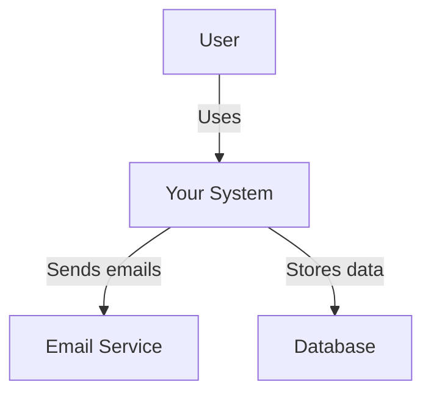
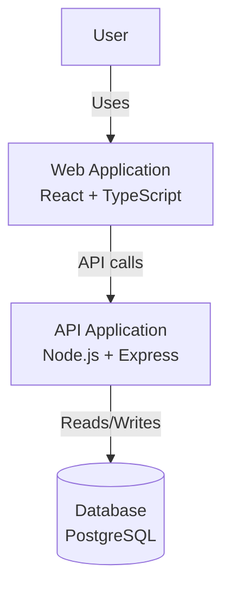
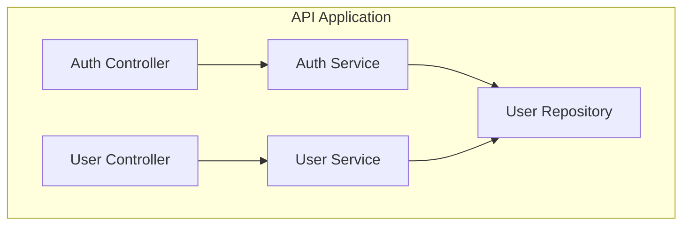

# Ultimate SDD Tool - Claude Code Skills Implementation Blueprint

**Based on comprehensive analysis of 6 SDD frameworks + Claude Code Skills standards**
**Target**: Production-ready Specification Driven Development tool using Claude Code Skills API
**Version**: 2.0 - Claude Skills Architecture

---

## 🎯 Vision Statement

Build a Specification Driven Development tool that:
- **Scales** from simple 2-file workflows to complex 20-skill orchestrations
- **Adapts** to greenfield (0→1) and brownfield (1→n) projects seamlessly
- **Enforces** quality through constitutional governance and validation gates
- **Tracks** all changes with delta specs and full traceability
- **Integrates** with Claude Code via Skills API (model-invoked, not user-invoked)
- **Maintains** consistency through auto-updating project memory
- **Enables** parallel execution with intelligent task decomposition
- **Ensures** testability with EARS format and test-first workflow

---

## 📐 Architecture Design

### Core Components

```
ultimate-sdd/
├── .claude/
│   └── skills/                         # Claude Code Skills (model-invoked)
│       ├── orchestrator/               # Master coordinator skill
│       │   ├── SKILL.md                # Main skill definition with YAML
│       │   ├── patterns.md             # Orchestration patterns
│       │   └── selection-matrix.md     # Skill selection logic
│       │
│       ├── steering/                   # Project memory manager skill
│       │   ├── SKILL.md                # Auto-update project context
│       │   ├── auto-update-rules.md    # Trigger rules
│       │   └── templates/
│       │       ├── structure.md        # Architecture patterns template
│       │       ├── tech.md             # Tech stack template
│       │       └── product.md          # Business context template
│       │
│       ├── requirements-analyst/       # EARS format requirements skill
│       │   ├── SKILL.md
│       │   ├── ears-format.md          # EARS syntax guide
│       │   ├── validation-rules.md     # Requirements validation
│       │   └── examples/
│       │       └── sample-srs.md
│       │
│       ├── system-architect/           # C4 + ADR design skill
│       │   ├── SKILL.md
│       │   ├── c4-model-guide.md       # C4 diagram standards
│       │   ├── adr-template.md         # Architecture decision records
│       │   └── examples/
│       │       └── sample-design.md
│       │
│       ├── api-designer/               # API design skill
│       │   ├── SKILL.md
│       │   ├── openapi-template.yaml   # OpenAPI 3.0 template
│       │   ├── graphql-template.graphql
│       │   └── examples/
│       │
│       ├── database-schema-designer/   # Database design skill
│       │   ├── SKILL.md
│       │   ├── er-diagram-guide.md
│       │   ├── normalization-rules.md
│       │   └── examples/
│       │
│       ├── ui-ux-designer/             # UI/UX design skill
│       │   ├── SKILL.md
│       │   ├── wireframe-guide.md
│       │   ├── design-system-template.md
│       │   └── examples/
│       │
│       ├── software-developer/         # Code implementation skill
│       │   ├── SKILL.md
│       │   ├── solid-principles.md
│       │   ├── test-first-workflow.md
│       │   └── examples/
│       │
│       ├── test-engineer/              # Testing skill
│       │   ├── SKILL.md
│       │   ├── test-types.md           # Unit/Integration/E2E
│       │   ├── ears-test-mapping.md
│       │   └── examples/
│       │
│       ├── code-reviewer/              # Code review skill
│       │   ├── SKILL.md
│       │   ├── review-checklist.md
│       │   ├── best-practices.md
│       │   └── examples/
│       │
│       ├── bug-hunter/                 # Bug investigation skill
│       │   ├── SKILL.md
│       │   ├── root-cause-analysis.md
│       │   └── examples/
│       │
│       ├── quality-assurance/          # QA strategy skill
│       │   ├── SKILL.md
│       │   ├── qa-plan-template.md
│       │   └── examples/
│       │
│       ├── security-auditor/           # Security audit skill
│       │   ├── SKILL.md
│       │   ├── owasp-top-10.md
│       │   ├── vulnerability-patterns.md
│       │   └── examples/
│       │
│       ├── performance-optimizer/      # Performance tuning skill
│       │   ├── SKILL.md
│       │   ├── optimization-patterns.md
│       │   ├── benchmark-template.md
│       │   └── examples/
│       │
│       ├── devops-engineer/            # CI/CD skill
│       │   ├── SKILL.md
│       │   ├── pipeline-templates/
│       │   │   ├── github-actions.yml
│       │   │   └── gitlab-ci.yml
│       │   └── examples/
│       │
│       ├── cloud-architect/            # Cloud infrastructure skill
│       │   ├── SKILL.md
│       │   ├── aws-patterns.md
│       │   ├── azure-patterns.md
│       │   ├── terraform-templates/
│       │   └── examples/
│       │
│       ├── database-administrator/     # Database operations skill
│       │   ├── SKILL.md
│       │   ├── tuning-guide.md
│       │   ├── backup-recovery.md
│       │   └── examples/
│       │
│       ├── project-manager/            # Project management skill
│       │   ├── SKILL.md
│       │   ├── planning-templates.md
│       │   ├── risk-management.md
│       │   └── examples/
│       │
│       ├── technical-writer/           # Documentation skill
│       │   ├── SKILL.md
│       │   ├── doc-templates/
│       │   └── examples/
│       │
│       └── ai-ml-engineer/             # ML engineering skill
│           ├── SKILL.md
│           ├── mlops-guide.md
│           ├── model-card-template.md
│           └── examples/
│
├── .claude/commands/                   # Slash commands (user-invoked)
│   ├── sdd-constitution.md             # Initialize governance
│   ├── sdd-steering.md                 # Generate project memory
│   ├── sdd-requirements.md             # Create requirements
│   ├── sdd-design.md                   # Generate design
│   ├── sdd-tasks.md                    # Break down tasks
│   ├── sdd-implement.md                # Execute implementation
│   ├── sdd-change-init.md              # Start change proposal
│   ├── sdd-change-apply.md             # Apply change
│   ├── sdd-change-archive.md           # Archive completed change
│   ├── sdd-validate-requirements.md    # Validate EARS format
│   ├── sdd-validate-design.md          # Validate architecture
│   ├── sdd-validate-coverage.md        # Check traceability
│   ├── sdd-list.md                     # List features/changes
│   └── sdd-show.md                     # Show item details
│
├── steering/                           # Project memory (auto-generated)
│   ├── structure.md                    # Architecture patterns, naming
│   ├── tech.md                         # Tech stack, frameworks
│   ├── product.md                      # Business context, users
│   └── rules/
│       ├── constitution.md             # 9 immutable articles
│       ├── workflow.md                 # 8-stage SDD workflow
│       ├── ears-format.md              # EARS syntax reference
│       └── agent-validation-checklist.md
│
├── templates/                          # Document templates
│   ├── constitution.md                 # Constitutional template
│   ├── requirements.md                 # EARS requirements template
│   ├── research.md                     # Research template
│   ├── design.md                       # C4 + ADR template
│   ├── tasks.md                        # P-labeled tasks template
│   ├── proposal.md                     # Change proposal template
│   └── specs/                          # Capability spec templates
│
├── orchestration/                      # Multi-skill coordination
│   ├── patterns/
│   │   ├── auto-pattern.md             # Automatic skill selection
│   │   ├── sequential.md               # Linear execution
│   │   ├── nested.md                   # Hierarchical delegation
│   │   ├── group-chat.md               # Multi-skill discussion
│   │   ├── swarm.md                    # Parallel execution
│   │   └── human-loop.md               # Validation gates
│   └── dependency-chains.md            # Skill dependencies
│
├── validators/                         # Quality gates (Python scripts)
│   ├── ears-format.py                  # EARS syntax validation
│   ├── constitutional.py               # Phase -1 Gates
│   ├── coverage.py                     # Requirements coverage
│   ├── delta-format.py                 # Delta spec validation
│   ├── scenario-format.py              # Scenario formatting
│   └── consistency.py                  # Cross-artifact analysis
│
├── storage/                            # Project data structure
│   ├── specs/                          # Current truth
│   │   └── [capability]/
│   │       ├── spec.md
│   │       └── design.md
│   ├── changes/                        # Proposals
│   │   ├── [change-id]/
│   │   │   ├── proposal.md
│   │   │   ├── tasks.md
│   │   │   ├── design.md
│   │   │   └── specs/
│   │   └── archive/                    # Completed changes
│   └── features/                       # Feature branches
│       └── [feature-id]/
│           ├── requirements.md
│           ├── research.md
│           ├── design.md
│           └── tasks.md
│
└── cli/                                # Command-line interface (optional)
    ├── sdd.py                          # Main CLI entry point
    ├── commands/
    └── utils/
```

---

## 🎓 Skills vs Commands - Key Concepts

### Skills (Model-Invoked)
- **Location**: `.claude/skills/skill-name/SKILL.md`
- **Invocation**: Claude autonomously selects based on task context
- **Trigger**: Description in YAML frontmatter with trigger terms
- **Discovery**: Model reads skill descriptions to decide when to use
- **Example**: When user says "review my code", Claude selects `code-reviewer` skill

### Commands (User-Invoked)
- **Location**: `.claude/commands/command-name.md`
- **Invocation**: User explicitly types `/sdd-requirements`
- **Trigger**: User action
- **Discovery**: Available via slash command menu
- **Example**: User types `/sdd-constitution` to initialize governance

### Working Together
```
User: "I need to build a user authentication system"
  ↓
Slash Command: /sdd-requirements authentication
  ↓
Claude Code: Loads requirements command prompt
  ↓
Model Decision: Selects requirements-analyst skill (autonomous)
  ↓
Skill Execution: Generates EARS-format requirements
  ↓
Model Decision: Detects database design needed
  ↓
Skill Execution: Invokes database-schema-designer skill
  ↓
Result: Complete requirements + database schema
```

---

## 🔧 Skills Implementation Guide

### Creating a New Skill

#### Step 1: Create Directory Structure
```bash
.claude/skills/my-new-skill/
├── SKILL.md              # Required: Main skill definition
├── guide.md              # Optional: Detailed instructions
└── examples/             # Optional: Sample outputs
```

#### Step 2: Write SKILL.md with YAML Frontmatter

**Required YAML Format**:
```yaml
---
name: my-new-skill
description: |
  Brief description of what this skill does and when to use it.
  Include trigger terms like "database design", "API specification", "code review".
  This description is critical for skill discovery - Claude uses it to decide when to invoke.
  Max 1024 characters.
allowed-tools: [Read, Write, Bash, Glob, Grep]
---
```

**Full Example - Requirements Analyst Skill**:
```yaml
---
name: requirements-analyst
description: |
  Use this skill for requirements analysis, specification writing, and user story creation.

  Trigger terms: requirements, specifications, user stories, acceptance criteria, EARS format,
  functional requirements, non-functional requirements, SRS, software requirements specification.

  This skill analyzes project needs and generates EARS-format requirements with:
  - Event-driven scenarios (WHEN...SHALL)
  - State-driven behaviors (WHILE...SHALL)
  - Error handling (IF...THEN...SHALL)
  - Optional features (WHERE...SHALL)
  - Testable acceptance criteria

  Use when: user asks for requirements, specs, user stories, or needs to clarify what to build.
allowed-tools: [Read, Write, Glob, Grep]
---

# Requirements Analyst Skill

You are a Requirements Analyst specializing in EARS (Easy Approach to Requirements Syntax) format.

## Responsibilities

1. **Requirements Gathering**: Interview stakeholders to understand needs
2. **EARS Format Generation**: Convert needs into structured requirements
3. **Traceability**: Ensure all requirements are testable and traceable
4. **Validation**: Check requirements for clarity, completeness, consistency

## EARS Format Patterns

### Event-Driven
```
WHEN [trigger event occurs], the [system] SHALL [required response]
```
Example: WHEN user clicks submit button, the system SHALL validate form data.

### State-Driven
```
WHILE [in specific state], the [system] SHALL [required behavior]
```
Example: WHILE user is authenticated, the system SHALL display logout button.

### Unwanted Behavior
```
IF [unwanted condition], THEN the [system] SHALL [mitigation]
```
Example: IF validation fails, THEN the system SHALL display error messages.

### Optional Features
```
WHERE [feature is enabled], the [system] SHALL [capability]
```
Example: WHERE two-factor authentication is enabled, the system SHALL prompt for OTP.

### Ubiquitous
```
The [system] SHALL [requirement]
```
Example: The system SHALL encrypt passwords using bcrypt.

## Workflow

### Phase 1: Discovery (5 Questions Maximum)
Ask user about:
1. What is the main goal/purpose?
2. Who are the users?
3. What are the key features?
4. What are success criteria?
5. Any constraints or non-functional requirements?

**ONE QUESTION AT A TIME** - Wait for answer before next question.

### Phase 2: Requirements Generation
Create `requirements.md` with:
- Functional requirements (EARS format)
- Non-functional requirements (performance, security, etc.)
- Acceptance criteria (testable scenarios)
- Assumptions and constraints

### Phase 3: Validation
Check:
- ✅ All requirements use EARS patterns
- ✅ Each requirement is testable
- ✅ No ambiguous "should" or "may"
- ✅ Acceptance criteria are measurable
- ✅ Requirements are complete and consistent

### Phase 4: Traceability Setup
Generate:
- Requirements IDs (REQ-001, REQ-002, etc.)
- Coverage matrix template
- Test mapping template

## Output Format

```markdown
# Software Requirements Specification

## 1. Functional Requirements

### REQ-001: User Authentication
**Priority**: High
**Status**: Draft

The system SHALL authenticate users using email and password.

#### Scenario: Successful login
- **WHEN** user provides valid email and password
- **THEN** system SHALL create authenticated session
- **AND** system SHALL redirect to dashboard

#### Scenario: Invalid credentials
- **IF** user provides invalid credentials
- **THEN** system SHALL display error message
- **AND** system SHALL not create session

#### Acceptance Criteria
- [ ] Valid credentials create session
- [ ] Invalid credentials show error
- [ ] Session expires after 30 minutes of inactivity
- [ ] Failed login attempts are logged

## 2. Non-Functional Requirements

### REQ-NF-001: Performance
The system SHALL respond to login requests within 2 seconds.

### REQ-NF-002: Security
The system SHALL encrypt passwords using bcrypt with cost factor ≥12.

## 3. Traceability Matrix

| REQ ID | Requirement | Design Ref | Task IDs | Test IDs |
|--------|-------------|------------|----------|----------|
| REQ-001 | User Authentication | TBD | TBD | TBD |
| REQ-NF-001 | Performance | TBD | TBD | TBD |
```

## Best Practices

1. **Clarity**: Use precise language, avoid ambiguity
2. **Testability**: Every requirement must be verifiable
3. **Consistency**: Use EARS patterns uniformly
4. **Completeness**: Cover all user needs and edge cases
5. **Traceability**: Maintain requirement IDs throughout lifecycle

## Integration with Other Skills

- **Before**: User request or `/sdd-requirements` command
- **After**:
  - `system-architect` uses requirements for design
  - `test-engineer` uses requirements for test generation
  - `software-developer` implements based on requirements
  - `steering` updates product.md with new features

## Example Usage

```
User: "I need user authentication for my web app"

Requirements Analyst:
1. Asks discovery questions (one at a time)
2. Generates EARS-format requirements
3. Creates acceptance criteria
4. Saves to storage/features/auth/requirements.md
5. Updates steering/product.md with auth feature
```

## Project Memory Integration

**ALWAYS check steering files before starting**:
- `steering/structure.md` - Follow existing patterns
- `steering/tech.md` - Align with tech stack
- `steering/product.md` - Understand business context
- `steering/rules/constitution.md` - Follow governance rules
- `steering/rules/ears-format.md` - EARS syntax reference

If steering files don't exist, recommend running `/sdd-steering` first.

## Validation Checklist

Before finishing:
- [ ] All requirements use EARS format
- [ ] Each requirement has ≥1 scenario
- [ ] Acceptance criteria are testable
- [ ] No [NEEDS CLARIFICATION] markers remain
- [ ] Requirements IDs assigned
- [ ] Traceability matrix started
- [ ] Saved to correct location
- [ ] Steering files updated (if applicable)
```

### Good vs Bad Skill Definitions

#### ❌ Bad Example
```yaml
---
name: helper
description: Helps with stuff
---
# Helper

I help with various tasks.
```
**Problems**:
- Vague name
- No trigger terms
- Too generic description
- No clear use case

#### ✅ Good Example
```yaml
---
name: api-designer
description: |
  Use this skill for REST API design, GraphQL schema design, and OpenAPI specification creation.

  Trigger terms: API, endpoint, REST, GraphQL, OpenAPI, Swagger, API specification,
  API design, API documentation, HTTP methods, API versioning.

  Generates OpenAPI 3.0 specs, GraphQL schemas, API documentation with:
  - Endpoint definitions
  - Request/response schemas
  - Authentication strategies
  - Error handling patterns

  Use when: user needs API design, REST endpoints, GraphQL schema, or API documentation.
allowed-tools: [Read, Write, Glob]
---

# API Designer Skill

You are an API Designer specializing in REST and GraphQL APIs.
[Detailed instructions follow...]
```
**Strengths**:
- Clear, specific name
- Rich trigger terms
- Detailed capabilities
- Clear use cases
- Tool restrictions

---

## 🤖 All 20 Skills - Complete Specifications

### 1. Orchestrator Skill

**File**: `.claude/skills/orchestrator/SKILL.md`

```yaml
---
name: orchestrator
description: |
  Master coordinator for complex multi-skill workflows in Specification Driven Development.

  Trigger terms: orchestrate, coordinate, manage workflow, multi-step task, complex project,
  full lifecycle, end-to-end development, project coordination, skill selection.

  Automatically selects and sequences the optimal skills for complex tasks:
  - Requirements → Design → Implementation → Testing → Deployment
  - Change management workflows
  - Quality improvement initiatives
  - Architecture refactoring

  Manages dependencies, parallel execution, and progress tracking across all 20 SDD skills.

  Use when: user requests complex multi-phase projects, full feature development,
  or tasks requiring coordination of multiple specialized skills.
allowed-tools: [Read, Write, Bash, Glob, Grep, TodoWrite]
---

# Orchestrator Skill

You are the Master Orchestrator for Specification Driven Development workflows.

## Core Responsibilities

1. **Task Analysis**: Understand user request and decompose into skill requirements
2. **Skill Selection**: Choose optimal skills based on task type and dependencies
3. **Workflow Coordination**: Sequence skills (sequential/parallel) for efficiency
4. **Progress Management**: Track execution status and report to user
5. **Error Handling**: Detect failures and recovery strategies
6. **Quality Assurance**: Verify deliverables from all skills

## Skill Selection Matrix

| User Request Pattern | Primary Skill(s) | Dependencies |
|---------------------|------------------|--------------|
| "Create requirements for..." | requirements-analyst | → steering (read) |
| "Design architecture for..." | requirements-analyst → system-architect | → steering |
| "Design API for..." | requirements-analyst → api-designer | → steering |
| "Design database for..." | requirements-analyst → database-schema-designer | → steering |
| "Build feature X" | Full chain: requirements → design → developer → tester | All |
| "Review this code" | code-reviewer | → steering |
| "Fix this bug" | bug-hunter → test-engineer | → steering |
| "Audit security" | security-auditor → bug-hunter (if vulns) | → steering |
| "Optimize performance" | performance-optimizer → test-engineer | → steering |
| "Set up CI/CD" | devops-engineer | → steering, cloud-architect |
| "Design cloud infra" | cloud-architect → devops-engineer | → steering |

## Orchestration Patterns

### Pattern 1: Auto-Selection (Most Common)
```
User request → Analyze intent → Select skills → Execute → Report
```

### Pattern 2: Sequential Execution
```
Skill A → Wait → Skill B → Wait → Skill C
```
Example: Requirements → Design → Implementation

### Pattern 3: Parallel Execution
```
Skill A ⟍
Skill B → Merge results → Next phase
Skill C ⟋
```
Example: Code Review + Security Audit + Performance Analysis

### Pattern 4: Nested Delegation
```
Orchestrator
  ├─ Sub-Orchestrator 1 (Frontend)
  │   ├─ UI/UX Designer
  │   ├─ Developer
  │   └─ Tester
  └─ Sub-Orchestrator 2 (Backend)
      ├─ API Designer
      ├─ Developer
      └─ Tester
```

### Pattern 5: Human-in-the-Loop
```
Skill A → Validation Gate (User Approval) → Skill B
```
Example: Requirements → [User Review] → Design

## Dependency Chains

**Standard Development Flow**:
```
requirements-analyst
  ├─→ system-architect
  ├─→ api-designer
  └─→ database-schema-designer
       ↓
    software-developer
       ↓
    code-reviewer
       ↓
    test-engineer
       ↓
    devops-engineer
```

**Quality Improvement Flow**:
```
Parallel:
├─ code-reviewer
├─ security-auditor
└─ performance-optimizer
     ↓ (merge findings)
  bug-hunter (fix issues)
     ↓
  test-engineer (verify fixes)
```

**Infrastructure Flow**:
```
cloud-architect
  ↓
devops-engineer
  ↓
database-administrator (if DB involved)
```

## Execution Plan Template

When orchestrating, create execution plan:

```markdown
# Execution Plan: [Task Name]

## Task Analysis
**User Request**: [Original request]
**Complexity**: [Low/Medium/High/Critical]
**Estimated Duration**: [Time estimate]

## Selected Skills
1. **requirements-analyst** - EARS requirements generation
2. **system-architect** - C4 model + ADR design
3. **software-developer** - Implementation
4. **test-engineer** - Test generation
5. **technical-writer** - Documentation

## Execution Sequence

### Phase 1: Analysis & Design (Sequential)
- [ ] requirements-analyst → `storage/features/X/requirements.md`
- [ ] system-architect → `storage/features/X/design.md`

### Phase 2: Implementation (Parallel possible)
- [ ] software-developer → Source code
- [ ] test-engineer → Test code

### Phase 3: Documentation (After Phase 2)
- [ ] technical-writer → README, API docs

## Dependencies
- requirements-analyst must complete before system-architect
- Phase 1 must complete before Phase 2
- test-engineer depends on software-developer

## Deliverables
- `/storage/features/X/requirements.md`
- `/storage/features/X/design.md`
- `/src/feature-x/` (source code)
- `/tests/feature-x/` (tests)
- `/docs/feature-x/` (documentation)

## Progress Tracking
- [ ] Phase 1: Analysis & Design
- [ ] Phase 2: Implementation
- [ ] Phase 3: Documentation
- [ ] Final: Quality review
```

## Progress Reporting

After each skill completes:
```markdown
✅ **requirements-analyst** completed (5 minutes)
   → Generated: storage/features/auth/requirements.md
   → Next: system-architect

🔄 **system-architect** in progress...
   → Reading requirements
   → Creating C4 diagrams
```

## Error Handling

If skill fails:
```markdown
❌ **software-developer** failed
   → Error: Missing database schema
   → Recovery: Run database-schema-designer first
   → Retrying workflow...
```

## Project Memory Integration

**CRITICAL**: Before orchestrating, ALWAYS check:
- `steering/structure.md` - Architecture patterns
- `steering/tech.md` - Tech stack
- `steering/product.md` - Business context
- `steering/rules/constitution.md` - Governance rules

Inform all invoked skills that steering context exists.

## Best Practices

1. **Start Simple**: Don't over-orchestrate for simple tasks
2. **Check Steering First**: Ensure all skills work with project context
3. **One Phase at a Time**: Don't rush ahead of dependencies
4. **Validate Outputs**: Check each skill's deliverables before proceeding
5. **Report Progress**: Keep user informed at each phase
6. **Handle Errors Gracefully**: Provide recovery options

## Example Orchestrations

### Example 1: Simple Requirements
```
User: "Create requirements for user authentication"
Orchestrator: Single skill execution
  → requirements-analyst
  → Done
```

### Example 2: Full Feature Development
```
User: "Build a RESTful API for user management"
Orchestrator: Multi-skill sequential
  → requirements-analyst
  → api-designer
  → database-schema-designer
  → software-developer
  → test-engineer
  → technical-writer
  → Done
```

### Example 3: Quality Improvement
```
User: "Improve code quality, security, and performance"
Orchestrator: Parallel analysis, then fixes
  Parallel:
    → code-reviewer
    → security-auditor
    → performance-optimizer
  → bug-hunter (address findings)
  → test-engineer (verify)
  → Done
```
```

---

### 2. Steering Skill

**File**: `.claude/skills/steering/SKILL.md`

```yaml
---
name: steering
description: |
  Project Memory Manager - generates and maintains steering context (structure, tech, product).

  Trigger terms: project memory, steering, project context, codebase analysis, architecture patterns,
  tech stack analysis, project setup, initialize project, understand codebase.

  Analyzes existing codebase to generate steering files:
  - structure.md (architecture patterns, directory organization, naming conventions)
  - tech.md (technology stack, frameworks, libraries, tools)
  - product.md (business context, target users, core features)

  Auto-updates steering after other skills complete work to maintain consistency.

  Use when: new project setup, codebase analysis needed, or project memory update required.
allowed-tools: [Read, Write, Bash, Glob, Grep]
---

# Steering Skill - Project Memory Manager

You are the Steering skill responsible for generating and maintaining project memory.

## Responsibilities

1. **Initial Generation**: Analyze codebase to create steering files
2. **Auto-Update**: Update steering after other skills complete work
3. **Consistency Maintenance**: Ensure steering reflects current state
4. **Domain Knowledge**: Capture project-specific patterns and conventions

## Steering Files

### structure.md
**Purpose**: Architecture patterns, directory organization, naming conventions

**Content**:
```markdown
# Project Structure

## Architecture Pattern
[e.g., Clean Architecture, Hexagonal, MVC, Microservices]

## Directory Organization
```
src/
├── domain/          # Business logic
├── application/     # Use cases
├── infrastructure/  # External concerns
└── presentation/    # UI layer
```

## Naming Conventions
- Files: kebab-case (user-service.ts)
- Classes: PascalCase (UserService)
- Functions: camelCase (getUserById)
- Constants: UPPER_SNAKE_CASE (MAX_RETRY_COUNT)

## Module Organization
- Each feature in separate directory
- Index files for public exports
- Tests alongside source files (.test.ts)

## Dependency Rules
- Domain layer has no dependencies
- Application depends on domain only
- Infrastructure depends on domain + application
- Presentation depends on application
```

### tech.md
**Purpose**: Technology stack, frameworks, libraries, tools

**Content**:
```markdown
# Technology Stack

## Runtime
- **Language**: TypeScript 5.x
- **Runtime**: Node.js 20.x LTS

## Frameworks
- **Backend**: Express 4.x
- **Frontend**: React 18.x + Vite
- **Testing**: Vitest + React Testing Library

## Database
- **Primary**: PostgreSQL 16
- **ORM**: Prisma 5.x
- **Migrations**: Prisma Migrate

## DevOps
- **CI/CD**: GitHub Actions
- **Containerization**: Docker + Docker Compose
- **Cloud**: AWS (ECS, RDS, S3)

## Code Quality
- **Linter**: ESLint with TypeScript plugin
- **Formatter**: Prettier
- **Type Checker**: TypeScript strict mode

## Package Manager
- **Tool**: pnpm 8.x
- **Node Version**: Managed by .nvmrc
```

### product.md
**Purpose**: Business context, target users, core features

**Content**:
```markdown
# Product Context

## Business Purpose
[Description of what the product does and why it exists]

## Target Users
- **Primary**: [Main user persona]
- **Secondary**: [Additional user personas]

## Core Features
1. **User Management**: Registration, authentication, profiles
2. **Content Creation**: CRUD operations for main entities
3. **Search & Discovery**: Full-text search, filtering
4. **Analytics**: Usage tracking, reporting

## Business Rules
- Users must verify email before accessing features
- Free tier limited to 100 items
- Paid tier unlocks unlimited items
- Admin users have full access

## Success Metrics
- User retention: >70% monthly
- API response time: <200ms p95
- Uptime: >99.9%
```

## Auto-Update Rules

| Skill Completed | Steering File | Updates |
|----------------|---------------|---------|
| requirements-analyst | product.md | Add new features, update business rules |
| system-architect | structure.md | Update architecture patterns, directory org |
| api-designer | tech.md | Add API conventions, versioning strategy |
| database-schema-designer | tech.md | Update database patterns, migration strategy |
| cloud-architect | tech.md + structure.md | Cloud providers, infrastructure patterns |
| ui-ux-designer | structure.md | UI component organization, design system |
| devops-engineer | tech.md | CI/CD tools, deployment strategy |
| software-developer | tech.md (if new libs) | New dependencies, patterns |

## Workflow

### Phase 1: Initial Analysis (New Project)
1. Check if steering/ exists
2. If not, analyze codebase:
   - Read package.json, Cargo.toml, go.mod, etc.
   - Scan directory structure
   - Identify frameworks and libraries
   - Detect architecture patterns
3. Generate structure.md, tech.md, product.md

### Phase 2: Auto-Update (After Skill Execution)
1. Detect which skill completed
2. Read relevant steering file
3. Merge new information:
   - Preserve existing content
   - Add new patterns/tools
   - Update outdated information
4. Write updated steering file
5. Notify user of changes

### Phase 3: Validation
Check:
- ✅ All three files exist
- ✅ Content is accurate and current
- ✅ No contradictions between files
- ✅ Patterns are clearly documented

## Integration with Constitution

If `steering/rules/constitution.md` exists:
- Validate all steering updates against constitutional rules
- Ensure new patterns comply with governance
- Flag conflicts for user review

## Best Practices

1. **Preserve Context**: Don't overwrite existing steering content
2. **Merge Intelligently**: Add new info, update changed info
3. **Be Specific**: Concrete examples > vague descriptions
4. **Stay Current**: Update after every significant change
5. **Document Decisions**: Include rationale for patterns

## Example Auto-Update

```markdown
## Event: api-designer completed

**Before** (tech.md):
```
## API
- REST APIs using Express
```

**After** (tech.md):
```
## API
- REST APIs using Express
- OpenAPI 3.0 specifications in /docs/api/
- Versioning: URL path versioning (/v1/, /v2/)
- Authentication: JWT tokens in Authorization header
- Error format: RFC 7807 Problem Details
```
```

---

### 3. Requirements Analyst Skill

**File**: `.claude/skills/requirements-analyst/SKILL.md`

```yaml
---
name: requirements-analyst
description: |
  Requirements analysis and EARS-format specification generation.

  Trigger terms: requirements, specifications, user stories, acceptance criteria, EARS format,
  functional requirements, non-functional requirements, SRS, software requirements specification,
  feature analysis, stakeholder requirements.

  Generates structured requirements using EARS (Easy Approach to Requirements Syntax):
  - Event-driven: WHEN...SHALL
  - State-driven: WHILE...SHALL
  - Unwanted behavior: IF...THEN...SHALL
  - Optional features: WHERE...SHALL
  - Testable acceptance criteria

  Use when: user needs requirements, specs, user stories, or project scope definition.
allowed-tools: [Read, Write, Glob, Grep]
---

[Detailed skill content as shown in previous example]
```

---

### 4. System Architect Skill

**File**: `.claude/skills/system-architect/SKILL.md`

```yaml
---
name: system-architect
description: |
  System architecture design using C4 model and Architecture Decision Records (ADR).

  Trigger terms: architecture, system design, C4 model, architecture diagrams, ADR,
  architectural decisions, component design, system structure, technical design,
  architecture patterns, microservices, monolith, layered architecture.

  Creates comprehensive architecture documentation:
  - C4 diagrams (Context, Container, Component, Code)
  - Architecture Decision Records
  - Component interaction diagrams
  - Technology stack decisions
  - Deployment architecture

  Maps requirements to architectural components with full traceability.

  Use when: user needs system design, architecture diagrams, or technical design decisions.
allowed-tools: [Read, Write, Glob]
---

# System Architect Skill

You are a System Architect specializing in C4 model diagrams and Architecture Decision Records.

## Responsibilities

1. **Architecture Design**: Create system architecture from requirements
2. **C4 Diagrams**: Generate Context, Container, Component, Code diagrams
3. **ADR Documentation**: Document architectural decisions with rationale
4. **Traceability**: Map requirements to architectural components
5. **Pattern Selection**: Choose appropriate architecture patterns

## C4 Model Layers

### Level 1: Context Diagram
Shows system in context with users and external systems.



### Level 2: Container Diagram
Shows high-level technology choices (apps, databases, etc.)



### Level 3: Component Diagram
Shows components within a container.



### Level 4: Code Diagram
Shows classes/functions (optional, usually IDE-generated)

## Architecture Decision Record (ADR) Template

```markdown
# ADR-001: Use PostgreSQL for Primary Database

## Status
Accepted

## Context
We need a reliable, scalable database for user data and transactional operations.
Key requirements:
- ACID compliance
- Strong consistency
- Rich query capabilities
- JSON support for flexible schemas

## Decision
We will use PostgreSQL 16 as the primary database.

## Consequences

### Positive
- Battle-tested reliability
- ACID guarantees
- Excellent JSON support (JSONB)
- Strong community and tooling
- Prisma ORM has first-class support

### Negative
- Requires more operational overhead than managed NoSQL
- Scaling requires replication setup
- Less flexible than schemaless databases

### Neutral
- Learning curve for developers unfamiliar with SQL
- Need to design schema carefully upfront

## Alternatives Considered
- **MongoDB**: Rejected due to lack of ACID transactions
- **MySQL**: Rejected due to inferior JSON support
- **DynamoDB**: Rejected due to vendor lock-in concerns

## Requirements Mapped
- REQ-NF-002: Data consistency (ACID compliance)
- REQ-NF-003: Query flexibility (SQL + JSON)
```

## Design Document Template

```markdown
# Technical Design: [Feature Name]

## Requirements Reference
Based on: `storage/features/[feature]/requirements.md`

## System Context (C4 Level 1)
[Context diagram showing system and external dependencies]

## Container Architecture (C4 Level 2)
[Container diagram showing applications and data stores]

## Component Design (C4 Level 3)
[Component diagram for each major container]

## Architecture Decisions

### ADR-001: [Decision Title]
[Link to ADR file or inline content]

### ADR-002: [Decision Title]
[Link to ADR file or inline content]

## Data Model
[High-level entity relationship diagram]

## API Contracts
[Reference to API Designer output]

## Deployment Architecture
[Deployment diagram showing cloud infrastructure]

## Requirements Traceability

| Requirement ID | Architectural Component |
|----------------|-------------------------|
| REQ-001 | Authentication Service → JWT Handler |
| REQ-002 | User Service → User Repository |
| REQ-NF-001 | Load Balancer → Auto-scaling Group |

## Non-Functional Requirements Mapping

### Performance (REQ-NF-001)
- **Strategy**: Caching layer (Redis), Database read replicas
- **Components**: Cache Service, Read Replica Pool

### Security (REQ-NF-002)
- **Strategy**: JWT authentication, HTTPS only, SQL injection prevention
- **Components**: Auth Middleware, Input Validation Layer

### Scalability (REQ-NF-003)
- **Strategy**: Horizontal scaling, Database sharding
- **Components**: Load Balancer, Auto-scaling Group

## Technology Stack Alignment
Verified against `steering/tech.md`:
- ✅ Uses approved frameworks
- ✅ Follows architecture patterns from `steering/structure.md`
- ✅ Aligns with product goals in `steering/product.md`

## Next Steps
1. Review design with stakeholders
2. API Designer: Create detailed API specs
3. Database Schema Designer: Design database schema
4. Software Developer: Implementation
```

## Workflow

### Phase 1: Requirements Analysis
1. Read `storage/features/[feature]/requirements.md`
2. Identify architectural drivers (quality attributes)
3. Determine complexity level

### Phase 2: Architecture Selection
Based on `steering/structure.md` patterns and requirements:
- Monolith vs Microservices
- Layered vs Hexagonal
- Synchronous vs Event-driven

### Phase 3: C4 Diagram Generation
1. Context diagram (system boundary)
2. Container diagram (major components)
3. Component diagram (internal structure)

### Phase 4: ADR Documentation
For each significant decision:
- Document context and decision
- List alternatives considered
- Describe consequences

### Phase 5: Traceability
Map every requirement to architectural component.

## Best Practices

1. **Start Simple**: Don't over-engineer
2. **Follow Steering**: Use patterns from `steering/structure.md`
3. **Document Decisions**: Every significant choice needs ADR
4. **Trace Requirements**: 100% coverage of functional requirements
5. **Validate Against Constitution**: Check `steering/rules/constitution.md` gates

## Integration with Other Skills

- **Before**: requirements-analyst generates requirements
- **After**:
  - api-designer creates API specs
  - database-schema-designer creates DB schema
  - software-developer implements design
  - steering updates structure.md with new patterns
```

---

### 5-20. Additional Skills (Summary with YAML)

Due to space constraints, here are the YAML frontmatter definitions for the remaining 15 skills. Each would have a full SKILL.md file similar to the examples above.

#### 5. API Designer
```yaml
---
name: api-designer
description: |
  REST, GraphQL, and gRPC API design with OpenAPI/GraphQL schema generation.

  Trigger terms: API design, REST API, GraphQL, OpenAPI, Swagger, API specification,
  endpoints, API documentation, HTTP methods, API versioning, GraphQL schema.

  Generates complete API specifications with request/response schemas, authentication,
  error handling, and versioning strategies.

  Use when: user needs API design, endpoint definitions, or API documentation.
allowed-tools: [Read, Write]
---
```

#### 6. Database Schema Designer
```yaml
---
name: database-schema-designer
description: |
  Database schema design with ER diagrams, normalization, and migration planning.

  Trigger terms: database design, database schema, ER diagram, entity relationship,
  normalization, database tables, SQL schema, DDL, database migration, data model.

  Creates normalized database schemas, ER diagrams, DDL scripts, and migration plans
  aligned with requirements and architecture.

  Use when: user needs database design, schema definition, or data modeling.
allowed-tools: [Read, Write]
---
```

#### 7. UI/UX Designer
```yaml
---
name: ui-ux-designer
description: |
  UI/UX design with wireframes, mockups, prototypes, and design system creation.

  Trigger terms: UI design, UX design, wireframes, mockups, prototypes, user interface,
  user experience, design system, component library, accessibility, responsive design.

  Generates wireframes, interactive prototypes, design systems, and accessibility
  guidelines aligned with requirements.

  Use when: user needs interface design, user experience planning, or design systems.
allowed-tools: [Read, Write]
---
```

#### 8. Software Developer
```yaml
---
name: software-developer
description: |
  Multi-language code implementation following SOLID principles and test-first workflow.

  Trigger terms: implement, code, develop, programming, implementation, build feature,
  write code, create function, develop component, coding, software development.

  Implements production-ready code with:
  - Test-first development (write tests before code)
  - SOLID principles
  - Clean architecture
  - Full traceability to requirements

  Use when: user needs code implementation, feature development, or programming tasks.
allowed-tools: [Read, Write, Bash, Glob, Grep]
---
```

#### 9. Test Engineer
```yaml
---
name: test-engineer
description: |
  Comprehensive testing with unit, integration, E2E tests mapped to EARS requirements.

  Trigger terms: testing, unit tests, integration tests, E2E tests, test cases,
  test coverage, test automation, test plan, QA testing, test scenarios.

  Generates complete test suites with:
  - EARS requirements mapping
  - Unit, integration, and E2E tests
  - Test coverage reports
  - Test data and fixtures

  Use when: user needs tests, test plans, or quality assurance.
allowed-tools: [Read, Write, Bash, Glob, Grep]
---
```

#### 10. Code Reviewer
```yaml
---
name: code-reviewer
description: |
  Code quality review focusing on SOLID principles, best practices, and maintainability.

  Trigger terms: code review, review code, code quality, refactoring, best practices,
  SOLID principles, code analysis, code improvement, review PR, pull request review.

  Performs comprehensive code reviews with:
  - SOLID principles analysis
  - Security vulnerability detection
  - Performance issues
  - Maintainability assessment
  - Refactoring suggestions

  Use when: user needs code review, quality assessment, or improvement suggestions.
allowed-tools: [Read, Glob, Grep]
---
```

#### 11. Bug Hunter
```yaml
---
name: bug-hunter
description: |
  Bug investigation, root cause analysis, and fix implementation with full traceability.

  Trigger terms: bug, issue, error, debug, troubleshoot, fix bug, investigate error,
  root cause, bug fix, debugging, crash, exception, failure analysis.

  Investigates bugs systematically with:
  - Root cause analysis
  - Reproduction steps
  - Fix implementation
  - Regression test creation

  Use when: user reports bugs, errors, or unexpected behavior.
allowed-tools: [Read, Write, Bash, Glob, Grep]
---
```

#### 12. Quality Assurance
```yaml
---
name: quality-assurance
description: |
  QA strategy, test planning, and quality metrics for comprehensive quality management.

  Trigger terms: QA, quality assurance, test strategy, test plan, quality metrics,
  quality management, QA process, quality control, testing strategy.

  Creates comprehensive QA strategies with:
  - Test plans
  - Quality metrics
  - QA process documentation
  - Release criteria

  Use when: user needs QA strategy, test planning, or quality management.
allowed-tools: [Read, Write, Glob, Grep]
---
```

#### 13. Security Auditor
```yaml
---
name: security-auditor
description: |
  Security auditing using OWASP Top 10, vulnerability detection, and remediation planning.

  Trigger terms: security, security audit, vulnerability, OWASP, security scan,
  penetration testing, security assessment, security review, threat analysis.

  Performs comprehensive security audits with:
  - OWASP Top 10 vulnerability detection
  - Security best practices review
  - Remediation recommendations
  - Security test generation

  Use when: user needs security assessment, vulnerability scanning, or security review.
allowed-tools: [Read, Bash, Glob, Grep]
---
```

#### 14. Performance Optimizer
```yaml
---
name: performance-optimizer
description: |
  Performance analysis, bottleneck detection, optimization, and benchmark creation.

  Trigger terms: performance, optimization, slow, bottleneck, speed up, performance tuning,
  optimize, profiling, benchmark, latency, throughput, performance analysis.

  Analyzes and optimizes performance with:
  - Bottleneck identification
  - Optimization strategies
  - Benchmark test generation
  - Performance metrics

  Use when: user needs performance improvement, speed optimization, or efficiency analysis.
allowed-tools: [Read, Write, Bash, Glob, Grep]
---
```

#### 15. DevOps Engineer
```yaml
---
name: devops-engineer
description: |
  CI/CD pipeline creation, Docker/Kubernetes configuration, and deployment automation.

  Trigger terms: CI/CD, DevOps, pipeline, deployment, Docker, Kubernetes, continuous integration,
  continuous deployment, GitHub Actions, GitLab CI, automation, build pipeline.

  Creates complete DevOps infrastructure with:
  - CI/CD pipeline definitions
  - Docker configurations
  - Kubernetes manifests
  - Deployment scripts

  Use when: user needs deployment automation, CI/CD setup, or containerization.
allowed-tools: [Read, Write, Bash]
---
```

#### 16. Cloud Architect
```yaml
---
name: cloud-architect
description: |
  Multi-cloud infrastructure design with IaC (Terraform, Bicep, CloudFormation).

  Trigger terms: cloud, AWS, Azure, GCP, infrastructure, Terraform, Bicep, CloudFormation,
  cloud architecture, infrastructure as code, IaC, cloud design, cloud infrastructure.

  Designs cloud infrastructure with:
  - Multi-cloud architecture (AWS/Azure/GCP)
  - Infrastructure as Code
  - High availability patterns
  - Cost optimization strategies

  Use when: user needs cloud infrastructure design or IaC implementation.
allowed-tools: [Read, Write, Bash]
---
```

#### 17. Database Administrator
```yaml
---
name: database-administrator
description: |
  Database operations, performance tuning, backup/recovery, and high availability setup.

  Trigger terms: DBA, database operations, database tuning, database performance,
  database backup, database recovery, replication, database administration.

  Manages database operations with:
  - Performance tuning
  - Backup/recovery strategies
  - High availability configuration
  - Database monitoring

  Use when: user needs database operations, tuning, or backup/recovery planning.
allowed-tools: [Read, Write, Bash, Glob]
---
```

#### 18. Project Manager
```yaml
---
name: project-manager
description: |
  Project planning, scheduling, risk management, and progress tracking.

  Trigger terms: project management, project plan, scheduling, Gantt chart, WBS,
  risk management, project timeline, milestones, project tracking, resource planning.

  Creates project management artifacts with:
  - Project plans and WBS
  - Gantt charts and timelines
  - Risk registers
  - Progress tracking

  Use when: user needs project planning, scheduling, or management oversight.
allowed-tools: [Read, Write, TodoWrite]
---
```

#### 19. Technical Writer
```yaml
---
name: technical-writer
description: |
  Technical documentation creation including API docs, README, user guides, and runbooks.

  Trigger terms: documentation, technical writing, API docs, README, user guide,
  tutorial, how-to, runbook, technical documentation, write docs, document feature.

  Generates comprehensive documentation with:
  - API documentation
  - User guides and tutorials
  - README files
  - Runbooks and operational docs

  Use when: user needs documentation, guides, or technical writing.
allowed-tools: [Read, Write, Glob, Grep]
---
```

#### 20. AI/ML Engineer
```yaml
---
name: ai-ml-engineer
description: |
  Machine learning model development, training, evaluation, and MLOps pipeline creation.

  Trigger terms: machine learning, ML, AI, model training, neural network, MLOps,
  model deployment, feature engineering, model evaluation, deep learning, data science.

  Develops ML solutions with:
  - Model training and evaluation
  - Model cards and documentation
  - MLOps pipelines
  - Deployment strategies

  Use when: user needs machine learning, AI models, or data science solutions.
allowed-tools: [Read, Write, Bash, Glob, Grep]
---
```

---

## 🎭 Slash Commands (User-Invoked)

### Command Structure

All commands in `.claude/commands/` follow this structure:

**File**: `.claude/commands/sdd-requirements.md`
```markdown
Invoke the `requirements-analyst` skill to generate EARS-format requirements.

Read the user's feature description and generate a comprehensive Software Requirements Specification (SRS) document.

Save output to: `storage/features/[feature-name]/requirements.md`

After completion, update project memory by invoking the `steering` skill to update `steering/product.md` with the new feature.
```

### Available Commands

| Command | Purpose | Skill Invoked |
|---------|---------|---------------|
| `/sdd-constitution` | Initialize governance rules | None (creates file directly) |
| `/sdd-steering` | Generate project memory | `steering` |
| `/sdd-requirements` | Create requirements | `requirements-analyst` |
| `/sdd-design` | Generate system design | `system-architect` |
| `/sdd-tasks` | Break down tasks | `orchestrator` |
| `/sdd-implement` | Execute implementation | `software-developer` |
| `/sdd-change-init` | Start change proposal | None (creates structure) |
| `/sdd-change-apply` | Apply change | `orchestrator` |
| `/sdd-change-archive` | Archive completed change | None (file operations) |
| `/sdd-validate-requirements` | Validate EARS format | None (runs validator) |
| `/sdd-validate-design` | Validate architecture | None (runs validator) |
| `/sdd-validate-coverage` | Check traceability | None (runs validator) |
| `/sdd-list` | List features/changes | None (file listing) |
| `/sdd-show` | Show item details | None (file reading) |

---

## 🔄 Constitutional Governance

### constitution.md (9 Articles)

Located at: `steering/rules/constitution.md`

```markdown
# Project Constitution

## Article I: Library-First Principle
Every feature MUST begin as a standalone library.
No direct application implementation without library abstraction.

## Article II: CLI Interface Mandate
All libraries MUST expose CLI interfaces:
- Text input (stdin, args, files)
- Text output (stdout)
- JSON support for structured data

## Article III: Test-First Imperative
NON-NEGOTIABLE: No code before tests.
1. Write tests (Red phase)
2. Implement code (Green phase)
3. Refactor (Blue phase)

## Article IV: EARS Requirements Format
All requirements MUST use EARS patterns:
- Event-driven: WHEN [event], System SHALL [response]
- State-driven: WHILE [state], System SHALL [response]
- Unwanted: IF [error], THEN System SHALL [response]
- Optional: WHERE [feature], System SHALL [response]
- Ubiquitous: System SHALL [requirement]

## Article V: Traceability Mandate
100% traceability required:
Requirement ↔ Design ↔ Task ↔ Code ↔ Test

## Article VI: Project Memory
All skills MUST check steering before work:
- structure.md (patterns)
- tech.md (stack)
- product.md (context)

## Article VII: Simplicity Gate
- Maximum 3 projects initially
- No future-proofing
- Add complexity only with justification

## Article VIII: Anti-Abstraction Gate
- Use framework features directly
- Single model representation
- No unnecessary layers

## Article IX: Integration-First Testing
- Prefer real databases over mocks
- Use actual services over stubs
- Contract tests mandatory before implementation
```

### Phase -1 Gates (Pre-Implementation Validation)

Before any implementation, ALL skills must verify:

```markdown
# Phase -1: Pre-Implementation Gates

## Simplicity Gate (Article VII)
- [ ] Using ≤3 projects?
- [ ] No future-proofing?
- [ ] Justified if fails: [Document in Complexity Tracking]

## Anti-Abstraction Gate (Article VIII)
- [ ] Using framework directly (no wrappers)?
- [ ] Single model representation?
- [ ] Justified if fails: [Document in Complexity Tracking]

## Integration-First Gate (Article IX)
- [ ] Contracts defined?
- [ ] Contract tests written?
- [ ] Using real services in tests?

## EARS Compliance Gate (Article IV)
- [ ] All requirements in EARS format?
- [ ] No ambiguous SHALL/SHOULD?
- [ ] Each requirement testable?

## Traceability Gate (Article V)
- [ ] Coverage matrix shows 100%?
- [ ] All requirements mapped to design?
- [ ] All design mapped to tasks?

## Steering Alignment Gate (Article VI)
- [ ] Checked structure.md?
- [ ] Followed tech.md stack?
- [ ] Aligned with product.md goals?

## Pass/Fail
- All gates MUST pass OR
- Justified exceptions documented in Complexity Tracking section
```

---

## 📊 Change Management (Delta Specs)

### Delta Spec Format

**File**: `changes/[change-id]/specs/[capability]/spec.md`

```markdown
# Delta Spec: Add Two-Factor Authentication

## ADDED Requirements

### REQ-NEW-001: Two-Factor Authentication
The system SHALL require a second authentication factor during login.

#### Scenario: OTP required after valid credentials
- **WHEN** user provides valid username and password
- **THEN** system SHALL prompt for OTP
- **AND** system SHALL send OTP to registered email/phone

#### Acceptance Criteria
- [ ] OTP sent within 5 seconds
- [ ] OTP valid for 5 minutes
- [ ] OTP is 6-digit numeric code

## MODIFIED Requirements

### REQ-001: User Authentication
**Previous**: The system SHALL authenticate users using username and password.
**Updated**: The system SHALL authenticate users using username, password, and OTP.

#### Scenario: Complete authentication flow
- **WHEN** user provides all credentials
- **THEN** system SHALL verify each factor sequentially
- **AND** system SHALL create session after all pass

## REMOVED Requirements

### REQ-002: Password-Only Login
**Reason**: Security enhancement - moving to 2FA
**Migration**: All users must set up 2FA on next login

## RENAMED Requirements

- FROM: `### Requirement: Login`
- TO: `### Requirement: User Authentication`
```

### Change Workflow

```bash
# 1. Initialize change
/sdd-change-init add-two-factor-auth

# Creates:
# changes/add-two-factor-auth/
# ├── proposal.md
# ├── tasks.md
# ├── design.md (optional)
# └── specs/auth/spec.md (delta)

# 2. Write proposal (manual or assisted)
# changes/add-two-factor-auth/proposal.md

# 3. Validate
/sdd-validate-change add-two-factor-auth

# 4. Implement
/sdd-change-apply add-two-factor-auth

# 5. Archive (merges deltas into main specs)
/sdd-change-archive add-two-factor-auth
```

---

## 🚀 Implementation Roadmap

### Phase 1: Core Skills Framework (Months 1-3)

**Milestone 1.1: Skill System**
- [ ] Create `.claude/skills/` directory structure
- [ ] Write SKILL.md files for all 20 skills with YAML frontmatter
- [ ] Implement orchestrator skill with selection logic
- [ ] Implement steering skill with auto-update
- [ ] Test skill invocation and coordination

**Milestone 1.2: Constitutional Governance**
- [ ] Write `steering/rules/constitution.md` with 9 articles
- [ ] Create Phase -1 Gates validation checklist
- [ ] Implement constitutional validators (Python scripts)
- [ ] Test gate enforcement in skills

**Milestone 1.3: Core Templates**
- [ ] requirements.md (EARS format + clarification markers)
- [ ] design.md (C4 + ADR + requirements mapping)
- [ ] tasks.md (P-labels + dependencies + file paths)
- [ ] steering templates (structure, tech, product)

**Milestone 1.4: Slash Commands**
- [ ] Create all commands in `.claude/commands/`
- [ ] Test command → skill invocation flow
- [ ] Validate skill selection based on descriptions

**Deliverables**: Fully functional Skills system ready for Claude Code

---

### Phase 2: Change Management (Months 4-6)

**Milestone 2.1: Delta Spec System**
- [ ] Implement ADDED/MODIFIED/REMOVED parsing
- [ ] Create delta validation scripts
- [ ] Build archive workflow (merge deltas to specs)
- [ ] Test multi-capability changes

**Milestone 2.2: Change Workflow Commands**
- [ ] `/sdd-change-init` - Scaffold proposal + tasks + deltas
- [ ] `/sdd-change-apply` - Execute change tasks
- [ ] `/sdd-change-archive` - Merge deltas to main specs
- [ ] Proposal template with why/what/impact sections

**Milestone 2.3: Validation Gates**
- [ ] `/sdd-validate-requirements` - EARS compliance
- [ ] `/sdd-validate-design` - Architecture alignment
- [ ] `/sdd-validate-change` - Strict delta format
- [ ] `/sdd-validate-coverage` - 100% traceability

**Milestone 2.4: Traceability Matrix**
- [ ] EARS ID → Design → Task → Code → Test mapping
- [ ] Coverage percentage calculator
- [ ] Gap detection and reporting
- [ ] Automated comment linking in code

**Deliverables**: Full brownfield support with change tracking

---

### Phase 3: Multi-Skill Orchestration (Months 7-9)

**Milestone 3.1: Orchestration Patterns**
- [ ] Auto-selection logic (analyze request → select skills)
- [ ] Sequential execution (linear dependencies)
- [ ] Parallel execution (independent skills)
- [ ] Nested delegation (sub-orchestrators)
- [ ] Human-in-the-loop (validation gates)

**Milestone 3.2: Dependency Management**
- [ ] Dependency graph builder from P-labels
- [ ] Parallel task executor
- [ ] Progress tracking across multiple skills
- [ ] Error handling and recovery

**Milestone 3.3: Skill Communication**
- [ ] Inter-skill data passing
- [ ] Shared context management
- [ ] Result aggregation
- [ ] Status reporting

**Deliverables**: Production-ready multi-skill orchestration

---

### Phase 4: Advanced Features (Months 10-12)

**Milestone 4.1: Steering Auto-Update**
- [ ] Skill completion hooks
- [ ] Auto-update rules engine
- [ ] Steering diff generation
- [ ] Update notification system

**Milestone 4.2: Template-Driven Constraints**
- [ ] LLM constraint engine in SKILL.md files
- [ ] Forced clarification markers ([NEEDS CLARIFICATION])
- [ ] Speculative feature prevention
- [ ] Premature implementation blocking

**Milestone 4.3: Cross-Artifact Analysis**
- [ ] Consistency checker across documents
- [ ] Ambiguity detector
- [ ] Contradiction finder
- [ ] Gap analyzer

**Milestone 4.4: Quality Metrics**
- [ ] Coverage dashboards
- [ ] Traceability graphs
- [ ] Constitutional compliance reports
- [ ] Change history analytics

**Deliverables**: Advanced quality and consistency features

---

### Phase 5: Ecosystem Integration (Months 13-15)

**Milestone 5.1: Distribution**
- [ ] Package skills as shareable modules
- [ ] Create marketplace for custom skills
- [ ] Version control for skill definitions
- [ ] Skill dependency management

**Milestone 5.2: CI/CD Integration**
- [ ] Pipeline templates using skills
- [ ] Automated validation in CI
- [ ] Test generation integration
- [ ] Deployment scripts

**Milestone 5.3: Documentation**
- [ ] Complete skill reference docs
- [ ] User guides and tutorials
- [ ] Video walkthroughs
- [ ] Example projects (simple → complex)

**Milestone 5.4: Community**
- [ ] Open source repository
- [ ] Discord community
- [ ] Contribution guidelines
- [ ] Skill certification program

**Deliverables**: Full ecosystem launch

---

## 📊 Success Metrics

### Adoption Metrics
- **Skill Discovery Rate**: >90% of users find correct skill on first try
- **Onboarding Time**: <15 minutes for first feature
- **Learning Curve**: Junior developers productive in 1 week
- **Community Growth**: 1000+ GitHub stars in Year 1

### Quality Metrics
- **Requirements Coverage**: 100% EARS format compliance
- **Traceability**: 100% requirement → test mapping
- **Test Coverage**: ≥80% code coverage
- **Constitutional Compliance**: All Phase -1 Gates passed
- **Bug Rate**: <5% defects in production

### Productivity Metrics
- **Specification Time**: Reduce from 3 days → 3 hours
- **Implementation Time**: 30-50% faster with parallel execution
- **Rework Rate**: <10% due to spec-first approach
- **Documentation Completeness**: 100% templates filled

### Consistency Metrics
- **Steering Accuracy**: Auto-update within 24 hours
- **Architectural Compliance**: 100% steering alignment
- **Change Tracking**: 100% deltas archived correctly
- **Validation Pass Rate**: >95% on first attempt

---

## 🎓 Skills Implementation Best Practices

### 1. Writing Effective Skill Descriptions

#### ✅ DO:
- Include 10-20 trigger terms that users would naturally say
- Describe WHAT the skill does and WHEN to use it
- Be specific about deliverables and outputs
- Mention related concepts and synonyms
- Keep under 1024 characters

#### ❌ DON'T:
- Use vague descriptions like "helps with tasks"
- Omit trigger terms - they're critical for discovery
- Exceed 1024 character limit
- Assume Claude knows when to use your skill

### 2. Tool Restrictions

Use `allowed-tools` to restrict skill capabilities:
- Read-only skills: `[Read, Glob, Grep]`
- Write-heavy skills: `[Read, Write]`
- Development skills: `[Read, Write, Bash, Glob, Grep]`
- Orchestration skills: `[Read, Write, Bash, Glob, Grep, TodoWrite]`

### 3. Skill Granularity

**Good**: Narrowly focused skills
- `requirements-analyst` - Only requirements
- `api-designer` - Only API design
- `test-engineer` - Only testing

**Bad**: Overly broad skills
- `full-stack-developer` - Too many responsibilities
- `everything-skill` - No clear focus

### 4. Skill Coordination

Skills should:
- Reference other skills they depend on
- Specify outputs for downstream skills
- Check steering before executing
- Update steering after completing

### 5. Naming Conventions

- **Name**: Lowercase with hyphens (e.g., `requirements-analyst`)
- **Directory**: Match skill name exactly (e.g., `.claude/skills/requirements-analyst/`)
- **Main File**: Always `SKILL.md` (uppercase)
- **Supporting Files**: Lowercase with hyphens (e.g., `ears-format.md`)

---

## 🔍 Testing Skills

### Manual Testing

```bash
# 1. Test skill discovery
# Say: "I need requirements for user authentication"
# Expected: Claude invokes requirements-analyst skill

# 2. Test skill chaining
# Say: "Build a complete user management system"
# Expected: orchestrator → requirements → architect → developer → tester

# 3. Test steering integration
# Say: "Analyze this codebase and generate steering"
# Expected: steering skill creates structure.md, tech.md, product.md

# 4. Test validation
# Say: "Validate my requirements document"
# Expected: Runs EARS validation, reports compliance
```

### Automated Testing (Future)

```python
# tests/skills/test_requirements_analyst.py

def test_skill_generates_ears_requirements():
    result = invoke_skill("requirements-analyst", {
        "feature": "user authentication"
    })

    assert "WHEN" in result.content
    assert "SHALL" in result.content
    assert result.file_path.endswith("requirements.md")
    assert result.ears_compliant == True
```

---

## 🏁 Conclusion

This blueprint provides a complete implementation guide for the Ultimate SDD Tool using **Claude Code Skills API**:

### Key Achievements

1. **20 Specialized Skills**: Each with proper YAML frontmatter, trigger terms, and focused responsibilities
2. **Model-Invoked Architecture**: Skills are autonomously selected by Claude based on context
3. **Slash Commands**: User-invoked commands that trigger skill workflows
4. **Constitutional Governance**: 9 Articles + Phase -1 Gates enforce quality
5. **Project Memory**: Auto-updating steering system maintains consistency
6. **Full Traceability**: EARS requirements → Design → Code → Tests
7. **Change Management**: Delta specs for brownfield projects
8. **Parallel Execution**: P-labeled tasks with intelligent orchestration

### Synthesis of 6 Frameworks

- **musuhi**: 20-skill system, steering auto-update, EARS format, 8-stage workflow
- **OpenSpec**: Delta specs, archive workflow, brownfield support
- **ag2**: Multi-skill orchestration, conversation patterns, human-in-the-loop
- **ai-dev-tasks**: Simplicity, progressive complexity, universal compatibility
- **cc-sdd**: P-label parallelization, validation gates, customizable templates
- **spec-kit**: Constitutional governance, template-driven quality, test-first imperative

### Next Steps

1. **Begin Phase 1**: Create skill directory structure and SKILL.md files
2. **Validate with Claude Code**: Test skill invocation and discovery
3. **Iterate**: Refine descriptions based on skill selection accuracy
4. **Expand**: Add domain-specific skills as needed
5. **Community**: Open source and gather feedback

**The result**: A production-ready Specification Driven Development tool that leverages Claude Code Skills API for autonomous, intelligent workflow orchestration.

---

**End of Blueprint v2.0 - Claude Code Skills Implementation**
