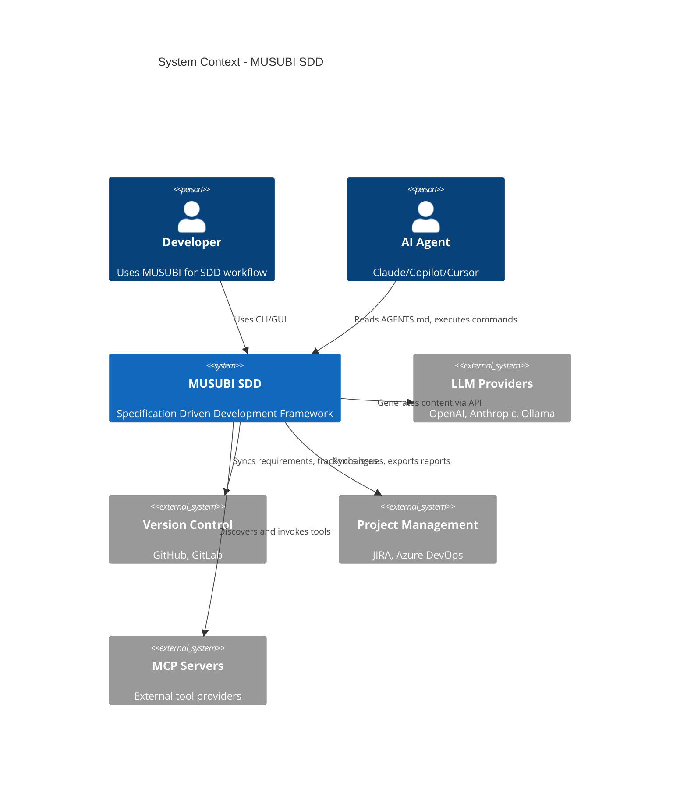
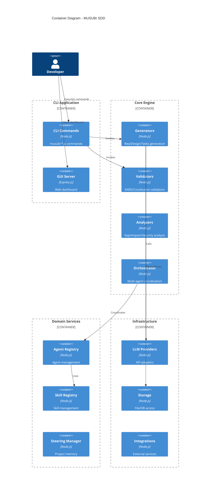
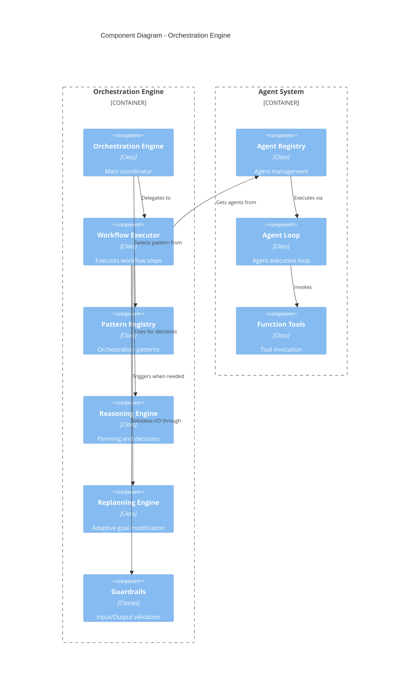

# MUSUBI Architecture Deep Dive

MUSUBI SDD の内部アーキテクチャと設計思想の詳細ガイド。

---

## 📖 目次

1. [システム概要](#システム概要)
2. [コアアーキテクチャ](#コアアーキテクチャ)
3. [モジュール構成](#モジュール構成)
4. [データフロー](#データフロー)
5. [オーケストレーションエンジン](#オーケストレーションエンジン)
6. [拡張ポイント](#拡張ポイント)
7. [設計決定記録（ADR）](#設計決定記録adr)

---

## システム概要

### ハイレベルアーキテクチャ

```
┌─────────────────────────────────────────────────────────────────────────────┐
│                              MUSUBI SDD v5.x                                │
├─────────────────────────────────────────────────────────────────────────────┤
│                                                                             │
│  ┌─────────────────────────────────────────────────────────────────────┐    │
│  │                        Presentation Layer                           │    │
│  │  ┌─────────┐  ┌─────────┐  ┌─────────┐  ┌─────────┐  ┌─────────┐   │    │
│  │  │   CLI   │  │   GUI   │  │  VSCode │  │   API   │  │   MCP   │   │    │
│  │  │ Commands│  │Dashboard│  │Extension│  │  Server │  │ Server  │   │    │
│  │  └─────────┘  └─────────┘  └─────────┘  └─────────┘  └─────────┘   │    │
│  └─────────────────────────────────────────────────────────────────────┘    │
│                                    │                                        │
│  ┌─────────────────────────────────▼───────────────────────────────────┐    │
│  │                        Application Layer                            │    │
│  │  ┌──────────────┐  ┌──────────────┐  ┌──────────────┐               │    │
│  │  │  Generators  │  │  Validators  │  │  Analyzers   │               │    │
│  │  │ (Req/Design/ │  │ (Constitution│  │ (Gap/Impact/ │               │    │
│  │  │  Tasks)      │  │  /EARS/Trace)│  │  Security)   │               │    │
│  │  └──────────────┘  └──────────────┘  └──────────────┘               │    │
│  │                                                                      │    │
│  │  ┌──────────────┐  ┌──────────────┐  ┌──────────────┐               │    │
│  │  │ Orchestration│  │  Replanning  │  │  Monitoring  │               │    │
│  │  │   Engine     │  │   Engine     │  │   & Costs    │               │    │
│  │  └──────────────┘  └──────────────┘  └──────────────┘               │    │
│  └─────────────────────────────────────────────────────────────────────┘    │
│                                    │                                        │
│  ┌─────────────────────────────────▼───────────────────────────────────┐    │
│  │                         Domain Layer                                │    │
│  │  ┌──────────────┐  ┌──────────────┐  ┌──────────────┐               │    │
│  │  │   Steering   │  │    Agents    │  │    Skills    │               │    │
│  │  │   (Memory)   │  │  (Registry)  │  │  (Registry)  │               │    │
│  │  └──────────────┘  └──────────────┘  └──────────────┘               │    │
│  │                                                                      │    │
│  │  ┌──────────────┐  ┌──────────────┐  ┌──────────────┐               │    │
│  │  │  Guardrails  │  │  Reasoning   │  │  Patterns    │               │    │
│  │  │ (Input/Output│  │ (Self-Correct│  │ (Sequential/ │               │    │
│  │  │  /Safety)    │  │  /Planning)  │  │  Triage/...)│               │    │
│  │  └──────────────┘  └──────────────┘  └──────────────┘               │    │
│  └─────────────────────────────────────────────────────────────────────┘    │
│                                    │                                        │
│  ┌─────────────────────────────────▼───────────────────────────────────┐    │
│  │                      Infrastructure Layer                           │    │
│  │  ┌──────────────┐  ┌──────────────┐  ┌──────────────┐               │    │
│  │  │ LLM Providers│  │  Integrations│  │  Performance │               │    │
│  │  │ (OpenAI/     │  │  (GitHub/    │  │  (Cache/     │               │    │
│  │  │  Anthropic)  │  │   JIRA/MCP)  │  │   Memory)    │               │    │
│  │  └──────────────┘  └──────────────┘  └──────────────┘               │    │
│  │                                                                      │    │
│  │  ┌──────────────┐  ┌──────────────┐  ┌──────────────┐               │    │
│  │  │   Storage    │  │   Converters │  │  Enterprise  │               │    │
│  │  │  (File/DB)   │  │  (IR/Parsers)│  │ (Multi-Tenant│               │    │
│  │  └──────────────┘  └──────────────┘  └──────────────┘               │    │
│  └─────────────────────────────────────────────────────────────────────┘    │
│                                                                             │
└─────────────────────────────────────────────────────────────────────────────┘
```

### 設計原則

| 原則 | 説明 | 実装例 |
|------|------|--------|
| **Separation of Concerns** | 各レイヤーは独立した責務 | Generators / Validators / Analyzers |
| **Dependency Inversion** | 上位レイヤーは抽象に依存 | LLM Provider Interface |
| **Open-Closed** | 拡張に開き、修正に閉じる | Plugin Architecture |
| **Single Responsibility** | 1クラス1責務 | 各 Skill が単一機能 |
| **Interface Segregation** | 必要なインターフェースのみ公開 | Public API vs Internal |

---

## コアアーキテクチャ

### C4 コンテキスト図



### C4 コンテナ図



### C4 コンポーネント図（オーケストレーション）



---

## モジュール構成

### ディレクトリ構造

```
src/
├── index.js                    # Public API エントリポイント
├── phase4-integration.js       # Phase 4 統合
├── phase5-integration.js       # Phase 5 統合
│
├── agents/                     # エージェントシステム
│   ├── index.js               # エージェントモジュールエクスポート
│   ├── agent-loop.js          # エージェント実行ループ
│   ├── function-tool.js       # ツール呼び出し抽象化
│   ├── registry.js            # エージェントレジストリ
│   ├── schema-generator.js    # JSONスキーマ生成
│   ├── agentic/               # Agentic パターン実装
│   │   ├── code-generator.js  # コード生成エージェント
│   │   └── code-reviewer.js   # コードレビューエージェント
│   └── browser/               # ブラウザエージェント
│       ├── action-executor.js # ブラウザアクション実行
│       ├── ai-comparator.js   # AI ベース比較
│       ├── context-manager.js # コンテキスト管理
│       └── ...
│
├── ai/                         # AI 機能
│   ├── index.js               # AI モジュールエクスポート
│   └── advanced-ai.js         # 高度なAI機能
│       ├── ModelRegistry      # モデルレジストリ
│       ├── ModelRouter        # タスクベースルーティング
│       ├── ContextWindowManager # コンテキストウィンドウ管理
│       ├── SemanticChunker    # セマンティックチャンキング
│       ├── CodeVectorStore    # コードベクトルストア
│       └── RAGPipeline        # RAG パイプライン
│
├── analyzers/                  # 分析エンジン
│   ├── ast-extractor.js       # AST 抽出
│   ├── codegraph-auto-update.js # コードグラフ自動更新
│   ├── complexity-analyzer.js # 複雑度分析
│   ├── context-optimizer.js   # コンテキスト最適化
│   ├── gap-detector.js        # ギャップ検出
│   ├── impact-analyzer.js     # 影響分析
│   ├── large-project-analyzer.js # 大規模プロジェクト分析
│   ├── repository-map.js      # リポジトリマッピング
│   ├── security-analyzer.js   # セキュリティ分析
│   ├── stuck-detector.js      # スタック検出
│   └── traceability.js        # トレーサビリティ分析
│
├── converters/                 # 仕様変換
│   ├── index.js               # 変換エクスポート
│   ├── ir/                    # 中間表現
│   │   └── types.js           # IR 型定義
│   ├── parsers/               # パーサー
│   │   ├── musubi-parser.js   # MUSUBI フォーマット
│   │   ├── openapi-parser.js  # OpenAPI
│   │   └── speckit-parser.js  # SpecKit
│   └── writers/               # ライター
│       ├── musubi-writer.js   # MUSUBI 出力
│       └── speckit-writer.js  # SpecKit 出力
│
├── enterprise/                 # エンタープライズ機能
│   ├── index.js               # エンタープライズエクスポート
│   └── multi-tenant.js        # マルチテナント
│       ├── TenantContext      # テナントコンテキスト
│       ├── TenantIsolation    # データ分離
│       ├── RBACManager        # ロールベースアクセス
│       ├── UsageQuota         # 使用量クォータ
│       └── AuditLogger        # 監査ログ
│
├── generators/                 # ドキュメント生成
│   ├── design.js              # 設計生成
│   ├── requirements.js        # 要件生成
│   ├── rust-migration-generator.js # Rust 移行
│   └── tasks.js               # タスク生成
│
├── gui/                        # Web GUI
│   ├── server.js              # Express サーバー
│   ├── public/                # 静的ファイル
│   │   └── index.html         # SPA エントリ
│   └── services/              # GUI サービス
│       ├── file-watcher.js    # ファイル監視
│       ├── project-scanner.js # プロジェクトスキャン
│       ├── replanning-service.js # リプランニング
│       ├── traceability-service.js # トレーサビリティ
│       └── workflow-service.js # ワークフロー
│
├── integrations/               # 外部統合
│   ├── index.js               # 統合エクスポート
│   ├── cicd.js                # CI/CD 統合
│   ├── codegraph-mcp.js       # CodeGraph MCP
│   ├── documentation.js       # ドキュメント統合
│   ├── enterprise-integrations.js # エンタープライズ統合
│   │   ├── JiraIntegration    # JIRA
│   │   ├── AzureDevOpsIntegration # Azure DevOps
│   │   ├── GitLabIntegration  # GitLab
│   │   ├── SlackIntegration   # Slack
│   │   ├── TeamsIntegration   # Teams
│   │   └── SSOIntegration     # SSO
│   ├── examples.js            # サンプル統合
│   ├── github-client.js       # GitHub クライアント
│   ├── mcp-connector.js       # MCP 接続
│   ├── mcp/                   # MCP サブモジュール
│   │   ├── mcp-context-provider.js
│   │   ├── mcp-discovery.js
│   │   └── mcp-tool-registry.js
│   ├── platforms.js           # プラットフォーム統合
│   └── tool-discovery.js      # ツール検出
│
├── llm-providers/              # LLM プロバイダー
│   ├── index.js               # プロバイダーエクスポート
│   ├── base-provider.js       # ベースクラス
│   ├── anthropic-provider.js  # Anthropic
│   ├── copilot-provider.js    # GitHub Copilot
│   ├── ollama-provider.js     # Ollama
│   └── openai-provider.js     # OpenAI
│
├── managers/                   # マネージャー
│   ├── index.js               # マネージャーエクスポート
│   ├── agent-memory.js        # エージェントメモリ
│   ├── change.js              # 変更管理
│   ├── checkpoint-manager.js  # チェックポイント
│   ├── delta-spec.js          # デルタ仕様
│   ├── memory-condenser.js    # メモリ凝縮
│   ├── repo-skill-manager.js  # リポジトリスキル
│   ├── skill-loader.js        # スキルローダー
│   ├── skill-tools.js         # スキルツール
│   └── workflow.js            # ワークフロー管理
│
├── monitoring/                 # 監視・モニタリング
│   ├── index.js               # モニタリングエクスポート
│   ├── cost-tracker.js        # コスト追跡
│   ├── incident-manager.js    # インシデント管理
│   ├── observability.js       # 可観測性
│   ├── quality-dashboard.js   # 品質ダッシュボード
│   └── release-manager.js     # リリース管理
│
├── orchestration/              # オーケストレーション
│   ├── index.js               # オーケストレーションエクスポート
│   ├── orchestration-engine.js # メインエンジン
│   ├── workflow-executor.js   # ワークフロー実行
│   ├── workflow-orchestrator.js # オーケストレーター
│   ├── skill-executor.js      # スキル実行
│   ├── skill-registry.js      # スキルレジストリ
│   ├── pattern-registry.js    # パターンレジストリ
│   ├── mcp-tool-adapters.js   # MCP ツールアダプター
│   ├── agent-skill-binding.js # エージェント-スキルバインディング
│   ├── error-handler.js       # エラーハンドリング
│   ├── workflow-examples.js   # ワークフロー例
│   ├── guardrails/            # ガードレール
│   │   ├── base-guardrail.js  # ベースガードレール
│   │   ├── guardrail-rules.js # ルール定義
│   │   ├── input-guardrail.js # 入力ガードレール
│   │   ├── output-guardrail.js # 出力ガードレール
│   │   └── safety-check.js    # 安全チェック
│   ├── patterns/              # オーケストレーションパターン
│   │   ├── auto.js            # 自動選択
│   │   ├── group-chat.js      # グループチャット
│   │   ├── handoff.js         # ハンドオフ
│   │   ├── human-in-loop.js   # Human-in-the-Loop
│   │   ├── nested.js          # ネスト
│   │   ├── sequential.js      # シーケンシャル
│   │   ├── swarm.js           # スウォーム
│   │   └── triage.js          # トリアージ
│   ├── reasoning/             # 推論エンジン
│   │   ├── planning-engine.js # プランニング
│   │   ├── reasoning-engine.js # 推論
│   │   └── self-correction.js # 自己修正
│   └── replanning/            # リプランニング
│       ├── adaptive-goal-modifier.js # 適応的目標修正
│       ├── alternative-generator.js # 代替案生成
│       ├── config.js          # 設定
│       ├── goal-progress-tracker.js # 目標進捗追跡
│       ├── plan-evaluator.js  # プラン評価
│       ├── plan-monitor.js    # プラン監視
│       ├── proactive-path-optimizer.js # 事前最適化
│       ├── replan-history.js  # リプラン履歴
│       └── replanning-engine.js # リプランニングエンジン
│
├── performance/                # パフォーマンス最適化
│   ├── index.js               # パフォーマンスエクスポート
│   ├── cache-manager.js       # キャッシュ管理
│   ├── lazy-loader.js         # 遅延ロード
│   ├── memory-optimizer.js    # メモリ最適化
│   └── startup-optimizer.js   # 起動最適化
│
├── reporters/                  # レポート生成
│   ├── coverage-report.js     # カバレッジレポート
│   ├── hierarchical-reporter.js # 階層レポート
│   └── traceability-matrix-report.js # トレーサビリティマトリクス
│
├── resolvers/                  # 問題解決
│   └── issue-resolver.js      # 課題解決
│
├── steering/                   # ステアリング（プロジェクトメモリ）
│   ├── index.js               # ステアリングエクスポート
│   ├── advanced-validation.js # 高度な検証
│   ├── auto-updater.js        # 自動更新
│   ├── quality-metrics.js     # 品質メトリクス
│   ├── steering-auto-update.js # ステアリング自動更新
│   ├── steering-validator.js  # ステアリング検証
│   └── template-constraints.js # テンプレート制約
│
├── templates/                  # テンプレート
│   ├── index.js               # テンプレートエクスポート
│   ├── locale-manager.js      # 多言語管理
│   ├── template-constraints.js # 制約定義
│   ├── agents/                # エージェントテンプレート
│   │   ├── claude-code/       # Claude Code
│   │   ├── codex/             # Codex
│   │   ├── cursor/            # Cursor
│   │   ├── gemini-cli/        # Gemini CLI
│   │   ├── github-copilot/    # GitHub Copilot
│   │   ├── qwen-code/         # Qwen Code
│   │   ├── shared/            # 共通
│   │   └── windsurf/          # Windsurf
│   ├── architectures/         # アーキテクチャテンプレート
│   ├── memories/              # メモリテンプレート
│   ├── shared/                # 共有テンプレート
│   └── skills/                # スキルテンプレート
│
└── validators/                 # 検証エンジン
    ├── advanced-validation.js # 高度な検証
    ├── constitution.js        # 憲法検証
    ├── constitutional-validator.js # 憲法バリデーター
    ├── critic-system.js       # クリティックシステム
    ├── delta-format.js        # デルタフォーマット検証
    └── traceability-validator.js # トレーサビリティ検証
```

### モジュール依存関係

```
                    ┌──────────────┐
                    │   bin/*.js   │ ← CLI エントリポイント
                    └──────┬───────┘
                           │
                           ▼
                    ┌──────────────┐
                    │  src/index   │ ← Public API
                    └──────┬───────┘
                           │
           ┌───────────────┼───────────────┐
           │               │               │
           ▼               ▼               ▼
    ┌──────────┐    ┌──────────┐    ┌──────────┐
    │generators│    │validators│    │analyzers │
    └────┬─────┘    └────┬─────┘    └────┬─────┘
         │               │               │
         └───────────────┴───────────────┘
                         │
                         ▼
                  ┌─────────────┐
                  │orchestration│ ← 中央調整
                  └──────┬──────┘
                         │
         ┌───────────────┼───────────────┐
         │               │               │
         ▼               ▼               ▼
    ┌──────────┐    ┌──────────┐    ┌──────────┐
    │  agents  │    │  skills  │    │ patterns │
    └────┬─────┘    └────┬─────┘    └────┬─────┘
         │               │               │
         └───────────────┴───────────────┘
                         │
                         ▼
    ┌────────────────────────────────────────────┐
    │              Infrastructure                 │
    │  ┌─────────┐  ┌──────────┐  ┌──────────┐   │
    │  │   llm   │  │integrations│  │performance│   │
    │  │providers│  │          │  │          │   │
    │  └─────────┘  └──────────┘  └──────────┘   │
    └────────────────────────────────────────────┘
```

---

## データフロー

### SDD ワークフロー

```
┌─────────────────────────────────────────────────────────────────────────────┐
│                         SDD Workflow Data Flow                              │
├─────────────────────────────────────────────────────────────────────────────┤
│                                                                             │
│  1. REQUIREMENTS PHASE                                                      │
│  ───────────────────                                                        │
│                                                                             │
│  User Input ─────► Requirements ─────► EARS Validator ─────► storage/      │
│  "User auth"       Generator          (Constitution)        features/      │
│                         │                   │               req.md         │
│                         │                   │                              │
│                    ┌────▼────┐         ┌────▼────┐                         │
│                    │   LLM   │         │ Steering │                        │
│                    │ Provider│         │  Memory  │                        │
│                    └─────────┘         └─────────┘                         │
│                                                                             │
│  2. DESIGN PHASE                                                           │
│  ──────────────                                                            │
│                                                                             │
│  Requirements ─────► Design ─────► C4 Validator ─────► storage/            │
│  (REQ-*.md)         Generator     (Architecture)       features/           │
│                         │              │               design.md           │
│                         │              │                                   │
│                    ┌────▼────┐    ┌────▼────┐                              │
│                    │   LLM   │    │   ADR   │                              │
│                    │ Provider│    │Generator│                              │
│                    └─────────┘    └─────────┘                              │
│                                                                             │
│  3. TASKS PHASE                                                            │
│  ─────────────                                                             │
│                                                                             │
│  Design ─────► Task ─────► Traceability ─────► storage/                    │
│  (design.md)  Generator    Validator           features/                   │
│                   │            │               tasks.md                    │
│                   │            │                                           │
│              ┌────▼────┐  ┌────▼────┐                                      │
│              │   LLM   │  │ Trace   │                                      │
│              │ Provider│  │ Matrix  │                                      │
│              └─────────┘  └─────────┘                                      │
│                                                                             │
│  4. IMPLEMENTATION PHASE                                                   │
│  ──────────────────────                                                    │
│                                                                             │
│  Tasks ─────► Orchestrator ─────► Agent Loop ─────► Code Files             │
│  (TASK-*)        │                    │                │                   │
│                  │                    │                │                   │
│             ┌────▼────┐          ┌────▼────┐     ┌────▼────┐               │
│             │ Pattern │          │  Skill  │     │ Guardrails│              │
│             │Selection│          │Executor │     │(I/O Check)│              │
│             └─────────┘          └─────────┘     └──────────┘              │
│                                                                             │
│  5. VALIDATION PHASE                                                       │
│  ──────────────────                                                        │
│                                                                             │
│  All Artifacts ─────► Validator ─────► Traceability ─────► Report          │
│                          │             Matrix              │               │
│                          │                │                │               │
│                     ┌────▼────┐      ┌────▼────┐      ┌────▼────┐          │
│                     │Constitution│    │Coverage │      │ Gap     │          │
│                     │ Checker   │    │ Report  │      │Detector │          │
│                     └──────────┘    └─────────┘      └─────────┘          │
│                                                                             │
└─────────────────────────────────────────────────────────────────────────────┘
```

### データ変換フロー

```
                    Input (Natural Language)
                              │
                              ▼
                    ┌─────────────────┐
                    │  Context Loader │ ← Steering files
                    └────────┬────────┘
                              │
                              ▼
                    ┌─────────────────┐
                    │   LLM Request   │ ← Prompt + Context
                    └────────┬────────┘
                              │
                              ▼
                    ┌─────────────────┐
                    │  LLM Response   │ ← Generated content
                    └────────┬────────┘
                              │
                              ▼
                    ┌─────────────────┐
                    │     Parser      │ ← Extract structure
                    └────────┬────────┘
                              │
                              ▼
                    ┌─────────────────┐
                    │    Validator    │ ← EARS/Constitution
                    └────────┬────────┘
                              │
                    ┌────────┴────────┐
                    │                 │
                    ▼                 ▼
              ✅ Valid           ❌ Invalid
                    │                 │
                    ▼                 ▼
              ┌──────────┐    ┌──────────┐
              │  Storage │    │   Self   │
              │   Write  │    │Correction│
              └──────────┘    └────┬─────┘
                                   │
                                   └────► Retry
```

---

## オーケストレーションエンジン

### パターン選択ロジック

```javascript
// src/orchestration/pattern-registry.js (概念図)

class PatternSelector {
  selectPattern(task, context) {
    const analysis = this.analyzeTask(task);
    
    // 複雑度に基づく選択
    if (analysis.complexity === 'high' && analysis.requiresExpertise) {
      return 'triage';  // ルーターが専門エージェントに振り分け
    }
    
    if (analysis.parallelizable && analysis.independentSubtasks > 3) {
      return 'swarm';   // 並列実行
    }
    
    if (analysis.requiresHumanApproval) {
      return 'human-in-loop';  // 人間の承認を挟む
    }
    
    if (analysis.steps && analysis.steps.length > 1) {
      return 'sequential';  // 順次実行
    }
    
    return 'auto';  // 自動選択
  }
}
```

### エージェントループ

```
┌─────────────────────────────────────────────────────────────────┐
│                       Agent Loop                                │
├─────────────────────────────────────────────────────────────────┤
│                                                                 │
│  ┌──────────┐    ┌──────────┐    ┌──────────┐    ┌──────────┐  │
│  │  Start   │───►│  Think   │───►│   Act    │───►│ Observe  │  │
│  └──────────┘    └────┬─────┘    └────┬─────┘    └────┬─────┘  │
│                       │               │               │         │
│                       │               │               │         │
│                  ┌────▼────┐     ┌────▼────┐     ┌────▼────┐   │
│                  │Reasoning│     │  Tool   │     │ Result  │   │
│                  │ Engine  │     │Execution│     │ Parser  │   │
│                  └─────────┘     └─────────┘     └─────────┘   │
│                       │               │               │         │
│                       └───────────────┴───────────────┘         │
│                                       │                         │
│                                       ▼                         │
│                              ┌────────────────┐                 │
│                              │  Goal Check    │                 │
│                              │ (Complete?)    │                 │
│                              └───────┬────────┘                 │
│                                      │                          │
│                           ┌──────────┴──────────┐               │
│                           │                     │               │
│                           ▼                     ▼               │
│                     ┌──────────┐          ┌──────────┐          │
│                     │  Done    │          │  Loop    │          │
│                     │ (Return) │          │ (Retry)  │          │
│                     └──────────┘          └──────────┘          │
│                                                                 │
└─────────────────────────────────────────────────────────────────┘
```

### ガードレールアーキテクチャ

```
                         Input
                           │
                           ▼
              ┌────────────────────────┐
              │    Input Guardrail     │
              │  ┌──────────────────┐  │
              │  │ • Prompt Injection │  │
              │  │ • PII Detection   │  │
              │  │ • Rate Limiting   │  │
              │  └──────────────────┘  │
              └───────────┬────────────┘
                          │
                          ▼
              ┌────────────────────────┐
              │     Agent Execution    │
              └───────────┬────────────┘
                          │
                          ▼
              ┌────────────────────────┐
              │   Output Guardrail     │
              │  ┌──────────────────┐  │
              │  │ • Content Safety  │  │
              │  │ • Schema Valid.   │  │
              │  │ • Constitution    │  │
              │  └──────────────────┘  │
              └───────────┬────────────┘
                          │
                          ▼
                       Output
```

---

## 拡張ポイント

### 1. LLM プロバイダー拡張

```javascript
// src/llm-providers/base-provider.js
class BaseLLMProvider {
  // 必須メソッド
  async complete(prompt, options) { throw new Error('Not implemented'); }
  async chat(messages, options) { throw new Error('Not implemented'); }
  async embed(text) { throw new Error('Not implemented'); }
  
  // オプションメソッド
  async stream(prompt, options) { /* ... */ }
  getTokenCount(text) { /* ... */ }
}

// カスタムプロバイダー例
class MyCustomProvider extends BaseLLMProvider {
  async complete(prompt, options) {
    const response = await fetch('https://my-llm-api.com/complete', {
      method: 'POST',
      body: JSON.stringify({ prompt, ...options })
    });
    return response.json();
  }
}
```

### 2. バリデーター拡張

```javascript
// カスタムバリデーターの追加
const { ValidatorRegistry } = require('musubi-sdd');

ValidatorRegistry.register('my-custom-validator', {
  name: 'My Custom Validator',
  targetTypes: ['requirements', 'design'],
  
  async validate(content, context) {
    const errors = [];
    
    // カスタム検証ロジック
    if (!content.includes('必須キーワード')) {
      errors.push({
        code: 'MISSING_KEYWORD',
        message: 'Required keyword not found',
        severity: 'error'
      });
    }
    
    return { valid: errors.length === 0, errors };
  }
});
```

### 3. オーケストレーションパターン拡張

```javascript
// カスタムパターンの追加
const { PatternRegistry } = require('musubi-sdd');

PatternRegistry.register('my-custom-pattern', {
  name: 'My Custom Pattern',
  description: 'A custom orchestration pattern',
  
  async execute(task, agents, context) {
    // カスタムオーケストレーションロジック
    const results = [];
    
    for (const agent of agents) {
      const result = await agent.execute(task, context);
      results.push(result);
      
      // カスタム条件でハンドオフ
      if (result.needsExpert) {
        const expert = context.findExpert(result.expertType);
        const expertResult = await expert.execute(task, context);
        results.push(expertResult);
      }
    }
    
    return this.aggregateResults(results);
  }
});
```

### 4. スキル拡張

```javascript
// カスタムスキルの追加
const { SkillRegistry } = require('musubi-sdd');

SkillRegistry.register('my-custom-skill', {
  name: 'My Custom Skill',
  triggers: ['my-keyword', 'custom-task'],
  
  context: `
    ## My Custom Skill
    
    This skill provides custom functionality for...
    
    ### Capabilities
    - Capability 1
    - Capability 2
  `,
  
  actions: {
    'my-action': {
      description: 'Perform my custom action',
      async execute(params, context) {
        // アクションロジック
        return { success: true, result: 'Action completed' };
      }
    }
  }
});
```

---

## 設計決定記録（ADR）

### ADR-001: モジュラーアーキテクチャ

**ステータス**: 採用  
**日付**: 2024-01-01  

**コンテキスト**:  
MUSUBI は多様なユースケース（CLI、GUI、VSCode 拡張、MCP サーバー）をサポートする必要がある。

**決定**:  
レイヤードアーキテクチャを採用し、各レイヤーを独立したモジュールとして実装。

**結果**:
- ✅ 各コンポーネントが独立してテスト可能
- ✅ 新しいインターフェース（API、VSCode等）を容易に追加
- ✅ 依存関係が明確で保守性が高い
- ⚠️ モジュール間の連携にインターフェース定義が必要

---

### ADR-002: LLM プロバイダー抽象化

**ステータス**: 採用  
**日付**: 2024-01-15  

**コンテキスト**:  
複数の LLM（OpenAI、Anthropic、Ollama）をサポートし、将来の新しいモデルにも対応したい。

**決定**:  
`BaseLLMProvider` 抽象クラスを定義し、各プロバイダーは継承して実装。

**結果**:
- ✅ 新しい LLM プロバイダーを容易に追加
- ✅ ユーザーは設定変更のみでプロバイダーを切り替え可能
- ✅ プロバイダー固有の機能も `options` で対応
- ⚠️ 各プロバイダーの API 差異を吸収するオーバーヘッド

---

### ADR-003: ガードレールシステム

**ステータス**: 採用  
**日付**: 2024-03-01  

**コンテキスト**:  
LLM 出力の品質と安全性を確保する必要がある。プロンプトインジェクション対策も必要。

**決定**:  
入力・出力の両方にガードレールを配置。Constitution ベースの検証を必須化。

**結果**:
- ✅ 不正な入力をブロック
- ✅ 出力が Constitution に準拠していることを保証
- ✅ PII 漏洩リスクを軽減
- ⚠️ ガードレール処理による若干のレイテンシ増加

---

### ADR-004: リプランニングエンジン

**ステータス**: 採用  
**日付**: 2024-06-01  

**コンテキスト**:  
長時間の自律実行中に問題が発生した場合、自動的に対処する仕組みが必要。

**決定**:  
`ReplanningEngine` を導入し、目標進捗追跡・代替案生成・適応的目標修正を実装。

**結果**:
- ✅ エラー発生時に自動リカバリー
- ✅ 人間の介入を最小化
- ✅ 複雑なタスクでも完了率が向上
- ⚠️ リプランニングロジックの複雑性増加

---

### ADR-005: マルチテナント対応

**ステータス**: 採用  
**日付**: 2025-12-01  

**コンテキスト**:  
エンタープライズ顧客向けに、テナント間のデータ分離と RBAC が必要。

**決定**:  
`TenantContext` をリクエストスコープで注入し、全サービスでテナント分離を実現。

**結果**:
- ✅ テナント間のデータ完全分離
- ✅ RBAC による細かいアクセス制御
- ✅ 使用量クォータと監査ログ
- ⚠️ テナントコンテキストの伝播コスト

---

## 📚 関連ドキュメント

- [API Reference](../API-REFERENCE.md)
- [Interactive Tutorials](./INTERACTIVE-TUTORIALS.md)
- [Plugin Development Guide](./PLUGIN-DEVELOPMENT.md)
- [Quickstart Guide](../QUICKSTART.md)

---

*© 2025 MUSUBI SDD - Architecture Deep Dive*
