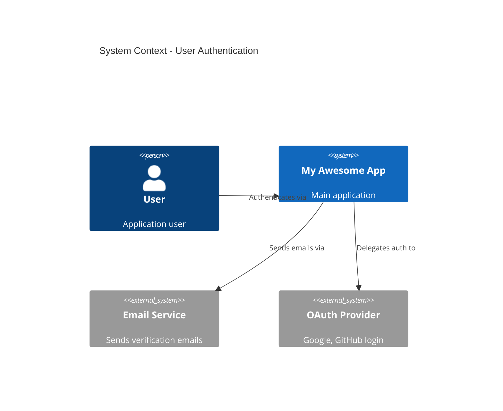
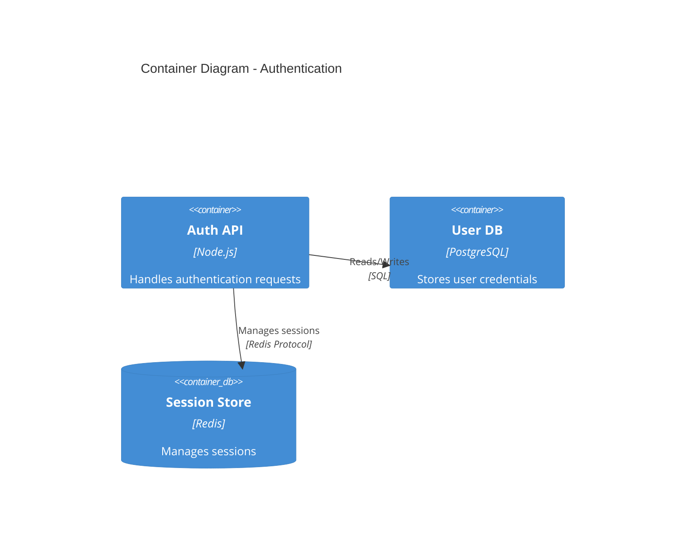

# MUSUBI Interactive Tutorials

ガイド付きオンボーディングで MUSUBI SDD をマスターしましょう。

---

## 🎯 チュートリアル一覧

| レベル | チュートリアル | 所要時間 | 学べること |
|--------|---------------|---------|-----------|
| 🟢 初級 | [1. 初めてのプロジェクト](#tutorial-1-初めてのプロジェクト) | 15分 | 基本セットアップ |
| 🟢 初級 | [2. 要件定義の基礎](#tutorial-2-要件定義の基礎) | 20分 | EARS形式 |
| 🟡 中級 | [3. 設計ドキュメント生成](#tutorial-3-設計ドキュメント生成) | 25分 | C4モデル、ADR |
| 🟡 中級 | [4. タスク分解とトレーサビリティ](#tutorial-4-タスク分解とトレーサビリティ) | 30分 | タスク生成、追跡 |
| 🔴 上級 | [5. マルチエージェント連携](#tutorial-5-マルチエージェント連携) | 45分 | オーケストレーション |
| 🔴 上級 | [6. エンタープライズ統合](#tutorial-6-エンタープライズ統合) | 60分 | JIRA、CI/CD連携 |

---

## Tutorial 1: 初めてのプロジェクト

### 🎯 学習目標
- MUSUBI のインストールと初期化
- プロジェクトメモリの理解
- 基本的なコマンドの実行

### ステップ 1: インストール

```bash
# グローバルインストール
npm install -g musubi-sdd

# バージョン確認
musubi --version
```

### ステップ 2: プロジェクト初期化

```bash
# 新しいプロジェクトディレクトリを作成
mkdir my-first-musubi-project
cd my-first-musubi-project

# MUSUBI を初期化（対話モード）
musubi init
```

**初期化時の質問:**
```
? Select your AI coding agent: (Use arrow keys)
❯ GitHub Copilot
  Claude Code
  Cursor
  Windsurf
  Codex CLI
  
? Select project language: 
❯ TypeScript
  JavaScript
  Python
  Go
  Rust
  
? Enable Japanese (bilingual) support? (Y/n)
```

### ステップ 3: 生成されたファイル確認

```
my-first-musubi-project/
├── steering/
│   ├── product.md      # 製品コンテキスト
│   ├── structure.md    # アーキテクチャ構造
│   ├── tech.md         # 技術スタック
│   └── rules/
│       ├── constitution.md  # 9条憲法
│       └── workflow.md      # SDDワークフロー
├── storage/
│   └── features/       # 機能仕様保存先
└── AGENTS.md           # エージェント設定
```

### ステップ 4: Steering ファイルのカスタマイズ

`steering/product.md` を開いて編集：

```markdown
# Product Context

## Project Name
My Awesome App

## Vision
ユーザーの生産性を10倍にするタスク管理アプリ

## Target Users
- フリーランス開発者
- 小規模チーム

## Success Metrics
- DAU 1,000+
- タスク完了率 80%+
```

### ✅ チェックポイント

```bash
# 設定の検証
musubi validate

# 期待される出力:
# ✅ Constitution: Valid
# ✅ Steering files: Complete
# ✅ Ready for SDD workflow
```

### 📝 演習問題

1. `steering/tech.md` を開いて、使用する技術スタックを記述してください
2. `musubi validate` を実行して、エラーがないことを確認してください

---

## Tutorial 2: 要件定義の基礎

### 🎯 学習目標
- EARS形式の要件記述
- 要件の自動検証
- 要件IDの管理

### EARS形式とは？

**E**asy **A**pproach to **R**equirements **S**yntax - 曖昧さのない要件記述のための構造化形式。

| パターン | テンプレート | 例 |
|----------|-------------|-----|
| Ubiquitous | The [system] shall [action] | The system shall display error messages in red |
| Event-Driven | When [trigger], the [system] shall [action] | When user clicks login, the system shall validate credentials |
| State-Driven | While [state], the [system] shall [action] | While offline, the system shall queue pending requests |
| Optional | Where [condition], the [system] shall [action] | Where user is admin, the system shall show settings panel |
| Unwanted | If [condition], then the [system] shall [action] | If password is incorrect, then the system shall log the attempt |

### ステップ 1: 要件生成

```bash
# 機能の要件を生成
musubi requirements "ユーザー認証機能"
```

**生成される出力 (`storage/specs/user-authentication-requirements.md`):**

```markdown
# User Authentication Requirements

## REQ-AUTH-001: Login Capability
**Type**: Functional  
**Priority**: Must Have  
**EARS**: When a user submits valid credentials, the system shall 
authenticate the user and create a session token.

### Acceptance Criteria
- [ ] AC-001: Valid email/password combination grants access
- [ ] AC-002: Session token expires after 24 hours
- [ ] AC-003: Failed login attempts are logged

## REQ-AUTH-002: Password Security
**Type**: Non-Functional  
**Priority**: Must Have  
**EARS**: The system shall hash passwords using bcrypt with 
a minimum cost factor of 12.
```

### ステップ 2: 要件の検証

```bash
# EARS形式の検証
musubi validate --requirements storage/specs/user-authentication-requirements.md
```

**検証結果:**
```
📋 Requirements Validation Report
━━━━━━━━━━━━━━━━━━━━━━━━━━━━━━━━

✅ REQ-AUTH-001: Valid EARS format (Event-Driven)
✅ REQ-AUTH-002: Valid EARS format (Ubiquitous)
⚠️  REQ-AUTH-003: Missing acceptance criteria

Summary: 2/3 requirements valid
```

### ステップ 3: 要件のトレーサビリティ

```bash
# トレーサビリティマトリクス生成
musubi trace --requirements
```

**出力:**
```
📊 Traceability Matrix
━━━━━━━━━━━━━━━━━━━━━━━

| Requirement   | Design      | Tasks       | Tests       |
|--------------|-------------|-------------|-------------|
| REQ-AUTH-001 | ⏳ Pending  | ⏳ Pending  | ⏳ Pending  |
| REQ-AUTH-002 | ⏳ Pending  | ⏳ Pending  | ⏳ Pending  |

Coverage: 0% → Next step: Generate design documents
```

### 📝 演習問題

1. 「商品検索機能」の要件を EARS 形式で 3 つ書いてください
2. `musubi validate` で要件が正しいことを確認してください

---

## Tutorial 3: 設計ドキュメント生成

### 🎯 学習目標
- C4モデルによるアーキテクチャ設計
- ADR（アーキテクチャ決定記録）の作成
- 設計と要件の紐付け

### ステップ 1: 設計生成

```bash
# 要件から設計を生成
musubi design "ユーザー認証機能"
```

**生成される出力 (`storage/specs/user-authentication-design.md`):**

```markdown
# User Authentication Design

## C4 Context Diagram



## C4 Container Diagram



## Architecture Decision Records

### ADR-001: Session Storage Strategy

**Status**: Accepted  
**Context**: Need to store user sessions with fast access  
**Decision**: Use Redis for session storage  
**Consequences**:
- ✅ Fast read/write operations
- ✅ Built-in TTL support
- ⚠️ Additional infrastructure to manage
```

### ステップ 2: 設計レビュー

```bash
# 設計の妥当性チェック
musubi validate --design storage/specs/user-authentication-design.md
```

### ステップ 3: トレーサビリティ更新

```bash
# 再度トレーサビリティを確認
musubi trace --all
```

**出力:**
```
📊 Traceability Matrix
━━━━━━━━━━━━━━━━━━━━━━━

| Requirement   | Design      | Tasks       | Tests       |
|--------------|-------------|-------------|-------------|
| REQ-AUTH-001 | ✅ Linked   | ⏳ Pending  | ⏳ Pending  |
| REQ-AUTH-002 | ✅ Linked   | ⏳ Pending  | ⏳ Pending  |

Coverage: 33% → Next step: Generate tasks
```

### 📝 演習問題

1. 生成された C4 ダイアグラムを Mermaid プレビューで確認してください
2. ADR を 1 つ追加してください（例: データベース選定理由）

---

## Tutorial 4: タスク分解とトレーサビリティ

### 🎯 学習目標
- 設計からタスクへの分解
- 実装優先順位の決定
- 完全なトレーサビリティの達成

### ステップ 1: タスク生成

```bash
# 設計からタスクを生成
musubi tasks "ユーザー認証機能"
```

**生成される出力 (`storage/specs/user-authentication-tasks.md`):**

```markdown
# User Authentication Tasks

## Phase 1: Core Infrastructure

### TASK-AUTH-001: Set up authentication database schema
**Traces to**: REQ-AUTH-001, REQ-AUTH-002  
**Estimated**: 2 hours  
**Priority**: P0  

**Subtasks**:
- [ ] Create users table with email, password_hash columns
- [ ] Add indexes for email lookup
- [ ] Set up migrations

### TASK-AUTH-002: Implement password hashing service
**Traces to**: REQ-AUTH-002  
**Estimated**: 1 hour  
**Priority**: P0  

**Subtasks**:
- [ ] Install bcrypt library
- [ ] Create hash() and verify() functions
- [ ] Add unit tests

## Phase 2: API Endpoints

### TASK-AUTH-003: Create login endpoint
**Traces to**: REQ-AUTH-001  
**Estimated**: 3 hours  
**Priority**: P0  

**Subtasks**:
- [ ] POST /api/auth/login route
- [ ] Request validation middleware
- [ ] Session creation logic
- [ ] Error handling
```

### ステップ 2: 実装開始

```bash
# 特定のタスクを実装
musubi implement TASK-AUTH-001
```

**エージェントへの指示が生成される:**
```markdown
## Implementation Task: TASK-AUTH-001

### Context
You are implementing the database schema for user authentication.

### Requirements Traced
- REQ-AUTH-001: Login capability
- REQ-AUTH-002: Password security (bcrypt)

### Design Reference
- See: storage/specs/user-authentication-design.md
- Database: PostgreSQL
- Schema conventions: snake_case

### Expected Deliverables
1. Migration file: `migrations/001_create_users_table.sql`
2. Type definitions: `src/types/user.ts`
3. Unit tests: `tests/models/user.test.ts`

### Acceptance Criteria
- [ ] Table created with all required columns
- [ ] Indexes added for email lookup
- [ ] Migration is reversible
```

### ステップ 3: 完了マーキング

タスク完了後:

```bash
# タスクを完了としてマーク
musubi trace --complete TASK-AUTH-001
```

**トレーサビリティ更新:**
```
📊 Traceability Matrix (Updated)
━━━━━━━━━━━━━━━━━━━━━━━━━━━━━━━━

| Requirement   | Design      | Tasks       | Tests       |
|--------------|-------------|-------------|-------------|
| REQ-AUTH-001 | ✅ Linked   | 🟡 1/2 Done | ⏳ Pending  |
| REQ-AUTH-002 | ✅ Linked   | ✅ Done     | ⏳ Pending  |

Coverage: 58%
```

---

## Tutorial 5: マルチエージェント連携

### 🎯 学習目標
- オーケストレーションパターンの理解
- 複数エージェントの協調動作
- 自動リプランニング

### オーケストレーションパターン

```
┌─────────────────────────────────────────────────────────────┐
│                    Orchestration Patterns                   │
├─────────────────────────────────────────────────────────────┤
│                                                             │
│  Sequential      Triage         Swarm          Handoff      │
│  ─────────       ──────         ─────          ──────       │
│  A → B → C       Router         Parallel       Expert       │
│                    │            Workers        Transfer     │
│                  ┌─┼─┐          ┌─┬─┐                       │
│                  │ │ │          │ │ │          A ──► B      │
│                  A B C          A B C                       │
│                                                             │
└─────────────────────────────────────────────────────────────┘
```

### ステップ 1: オーケストレーション開始

```bash
# マルチエージェントでタスク実行
musubi orchestrate "ユーザー認証機能の完全実装" --pattern triage
```

**オーケストレーションフロー:**
```
🎭 Orchestration Started
━━━━━━━━━━━━━━━━━━━━━━━━━━

Pattern: Triage (Router-based)

Agent Assignment:
├── 📋 Requirements Analyst → REQ validation
├── 🏗️ System Architect → Design review
├── 💻 Software Developer → Implementation
├── 🧪 Test Engineer → Test generation
└── 🔍 Code Reviewer → Quality check

Progress:
[████████░░░░░░░░░░░░] 40%

Current: Software Developer implementing TASK-AUTH-003
```

### ステップ 2: リアルタイム監視

```bash
# GUI でオーケストレーションを監視
musubi gui start --port 3000
```

ブラウザで `http://localhost:3000` を開く:

```
┌─────────────────────────────────────────────────────────────┐
│  MUSUBI Orchestration Dashboard                             │
├─────────────────────────────────────────────────────────────┤
│                                                             │
│  Active Agents: 3/5                                         │
│  ┌─────────────┬─────────────┬─────────────┐                │
│  │ Architect   │ Developer   │ Tester      │                │
│  │ ✅ Complete │ 🔄 Working  │ ⏳ Waiting  │                │
│  └─────────────┴─────────────┴─────────────┘                │
│                                                             │
│  Token Usage: 45,230 / 100,000                              │
│  Estimated Cost: $0.45                                      │
│  Elapsed: 12:34                                             │
│                                                             │
└─────────────────────────────────────────────────────────────┘
```

### ステップ 3: 自動リプランニング

問題発生時の自動対応:

```
⚠️ Issue Detected
━━━━━━━━━━━━━━━━━━

Problem: Database connection timeout during TASK-AUTH-003
Impact: 2 dependent tasks blocked

🔄 Replanning in progress...

New Plan:
1. ✅ Switch to in-memory mock DB for development
2. 🔄 Continue implementation with mock
3. ⏳ Add real DB integration as separate task
4. ⏳ Run integration tests later

Approve replan? [Y/n]
```

---

## Tutorial 6: エンタープライズ統合

### 🎯 学習目標
- JIRA との双方向同期
- CI/CD パイプライン統合
- チーム通知設定

### ステップ 1: JIRA 統合設定

```javascript
// .musubi/integrations.js
module.exports = {
  jira: {
    baseUrl: 'https://your-company.atlassian.net',
    projectKey: 'MYAPP',
    auth: {
      type: 'api-token',
      email: process.env.JIRA_EMAIL,
      token: process.env.JIRA_API_TOKEN
    },
    sync: {
      requirements: true,    // REQ → JIRA Epic
      tasks: true,           // TASK → JIRA Story
      bidirectional: true    // 双方向同期
    }
  }
};
```

### ステップ 2: CI/CD 統合

**GitHub Actions 設定 (`.github/workflows/musubi-validate.yml`):**

```yaml
name: MUSUBI Validation

on:
  pull_request:
    paths:
      - 'storage/specs/**'
      - 'steering/**'

jobs:
  validate:
    runs-on: ubuntu-latest
    steps:
      - uses: actions/checkout@v4
      
      - name: Setup Node.js
        uses: actions/setup-node@v4
        with:
          node-version: '20'
          
      - name: Install MUSUBI
        run: npm install -g musubi-sdd
        
      - name: Validate Constitution
        run: musubi validate --constitution
        
      - name: Check Traceability
        run: musubi trace --coverage --min 80
        
      - name: Security Audit
        run: musubi analyze --security
```

### ステップ 3: Slack 通知

```javascript
// .musubi/notifications.js
module.exports = {
  slack: {
    webhookUrl: process.env.SLACK_WEBHOOK_URL,
    channel: '#dev-notifications',
    events: {
      'orchestration.complete': true,
      'validation.failed': true,
      'replan.required': true
    },
    template: {
      'orchestration.complete': {
        text: '✅ Orchestration complete for {{feature}}',
        blocks: [
          {
            type: 'section',
            text: {
              type: 'mrkdwn',
              text: '*Feature*: {{feature}}\n*Duration*: {{duration}}\n*Cost*: {{cost}}'
            }
          }
        ]
      }
    }
  }
};
```

### ステップ 4: SSO 設定（SAML）

```javascript
// .musubi/auth.js
module.exports = {
  sso: {
    type: 'saml',
    entryPoint: 'https://idp.your-company.com/sso/saml',
    issuer: 'musubi-sdd',
    cert: process.env.SAML_CERT,
    callbackUrl: 'https://musubi.your-company.com/auth/callback'
  },
  rbac: {
    roles: {
      admin: ['*'],
      developer: ['read', 'write', 'orchestrate'],
      viewer: ['read']
    }
  }
};
```

---

## 🏆 認定チェックリスト

すべてのチュートリアルを完了したら、以下をセルフチェック：

### 初級認定 🟢
- [ ] MUSUBI をインストールし、プロジェクトを初期化できる
- [ ] EARS 形式で要件を記述できる
- [ ] `musubi validate` でエラーを解消できる

### 中級認定 🟡
- [ ] C4 モデルで設計を表現できる
- [ ] ADR を適切に記録できる
- [ ] タスク分解とトレーサビリティを維持できる

### 上級認定 🔴
- [ ] オーケストレーションパターンを選択・実行できる
- [ ] リプランニングを理解し対応できる
- [ ] エンタープライズ統合を設定できる

---

## 📚 次のステップ

- [Plugin Development Guide](./PLUGIN-DEVELOPMENT.md) - 独自拡張の作成
- [Architecture Deep Dive](./ARCHITECTURE-DEEP-DIVE.md) - 内部設計の理解
- [API Reference](../API-REFERENCE.md) - 完全なAPIドキュメント

---

*© 2025 MUSUBI SDD - Ultimate Specification Driven Development*
