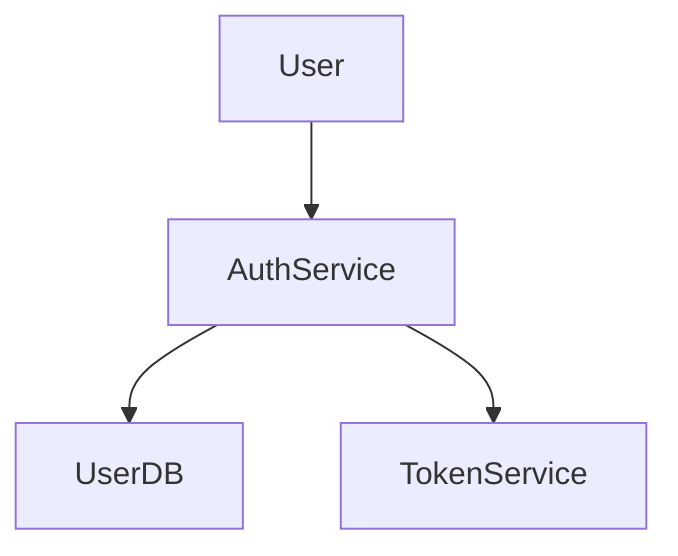

# Brownfield Project Tutorial

This tutorial guides you through converting an **existing (brownfield) project** to use MUSUBI's Specification Driven Development methodology.

## Overview

Brownfield projects are existing codebases that weren't built with SDD. MUSUBI provides tools to:

1. **Analyze** your current project structure
2. **Generate** initial specifications from code
3. **Establish** traceability links
4. **Manage** future changes with delta specs

## Prerequisites

- Node.js 18+
- An existing project with source code
- Basic understanding of MUSUBI concepts

## Step 1: Initialize MUSUBI

Navigate to your project root and initialize:

```bash
cd your-project
npx musubi-init
```

This creates the MUSUBI directory structure:

```
your-project/
├── steering/
│   ├── structure.md      # Architecture patterns
│   ├── tech.md          # Technology stack
│   ├── product.md       # Product context
│   └── rules/
│       └── constitution.md
├── storage/
│   ├── changes/         # Delta specifications
│   ├── features/        # Feature specs
│   └── specs/           # Main specifications
├── docs/
│   ├── requirements/    # EARS requirements
│   ├── design/          # Design documents
│   └── tasks/           # Task breakdowns
└── tests/               # Your existing tests
```

## Step 2: Analyze Current Structure

Run the analysis command to understand your codebase:

```bash
npx musubi-analyze
```

MUSUBI will scan your project and generate a report:

```
📊 Codebase Analysis Complete

Files Analyzed: 127
├── Source files: 89
├── Test files: 38
├── Config files: 12

Detected Patterns:
├── REST API endpoints: 15
├── Database models: 8
├── Service classes: 12
├── Utility functions: 24

Suggested Requirements:
├── REQ-001: User authentication (inferred from auth.js)
├── REQ-002: Data persistence (inferred from models/)
├── REQ-003: API endpoints (inferred from routes/)
└── ... 12 more suggestions

Coverage Estimate:
├── Code with tests: 65%
├── Code with comments: 42%
└── Documented APIs: 30%
```

## Step 3: Generate Initial Requirements

Based on the analysis, generate initial EARS requirements:

```bash
npx musubi-requirements generate --from-analysis
```

This creates requirements documents in `docs/requirements/`:

```markdown
# REQ-001: User Authentication

## EARS Statement
**WHERE** a user attempts to access protected resources,
**THE SYSTEM SHALL** verify user credentials before granting access.

## Source
- Inferred from: `src/auth/auth.js`, `src/middleware/authMiddleware.js`
- Related tests: `tests/auth.test.js`

## Status
- [ ] Reviewed
- [ ] Validated
- [ ] Approved
```

### Review and Refine

Manually review the generated requirements:

1. **Verify accuracy** - Ensure the inferred behavior matches intent
2. **Add context** - Include business context and constraints
3. **Assign IDs** - Confirm requirement ID scheme
4. **Link to code** - Verify source file references

## Step 4: Generate Design Documents

Extract design patterns from your code:

```bash
npx musubi-design generate --from-code
```

Example output in `docs/design/`:

```markdown
# DES-001: Authentication System

## C4 Context


## Components
| Component | File | Purpose |
|-----------|------|---------|
| AuthService | src/auth/auth.js | Handle authentication |
| TokenService | src/auth/tokens.js | JWT management |
| AuthMiddleware | src/middleware/auth.js | Request validation |

## Related Requirements
- REQ-001: User Authentication
- REQ-002: Session Management
```

## Step 5: Establish Traceability Links

Add traceability markers to your source code:

```javascript
/**
 * Authentication Service
 * 
 * @requirement REQ-001 User Authentication
 * @design DES-001 Authentication System
 */
class AuthService {
  /**
   * Validate user credentials
   * @requirement REQ-001.1 Credential Validation
   */
  async validateCredentials(username, password) {
    // Implementation
  }
}
```

Add markers to test files:

```javascript
/**
 * @requirement REQ-001 User Authentication
 * @tests REQ-001.1, REQ-001.2
 */
describe('AuthService', () => {
  it('should validate correct credentials', () => {
    // Test implementation
  });
});
```

### Auto-Link Tool

MUSUBI can suggest links automatically:

```bash
npx musubi-trace auto-link --suggest
```

```
Suggested Links:
  src/auth/auth.js
    └── Likely implements: REQ-001, REQ-002
  
  tests/auth.test.js
    └── Likely tests: REQ-001, REQ-002

Apply suggestions? (y/n)
```

## Step 6: Validate Traceability

Check your traceability coverage:

```bash
npx musubi-trace coverage
```

```
📊 Traceability Coverage

Requirements: 15
├── With design: 12 (80%)
├── With code: 10 (67%)
├── With tests: 8 (53%)
└── Fully traced: 6 (40%)

Gaps Detected:
├── REQ-005: Missing design document
├── REQ-008: No linked tests
└── REQ-012: No implementation found

Recommendations:
1. Create design doc for REQ-005
2. Add tests for REQ-008
3. Implement or remove REQ-012
```

## Step 7: Set Up Change Management

For future changes, use delta specifications:

```bash
# Create a change proposal
npx musubi-change init --title "Add Password Reset" --type feature

# Edit the delta spec
code storage/changes/CHG-xxx/delta-spec.md

# Validate the change
npx musubi-change validate CHG-xxx

# Analyze impact
npx musubi-change impact CHG-xxx
```

## Step 8: Configure CI Integration

Add traceability checks to your CI pipeline:

```yaml
# .github/workflows/traceability.yml
name: Traceability Check

on: [pull_request]

jobs:
  check:
    runs-on: ubuntu-latest
    steps:
      - uses: actions/checkout@v4
      - uses: actions/setup-node@v4
        with:
          node-version: '20'
      
      - run: npm ci
      
      - name: Validate Traceability
        run: npx musubi-trace ci-check --threshold 80
      
      - name: Generate Report
        run: npx musubi-trace html-report -o report.html
      
      - name: Upload Report
        uses: actions/upload-artifact@v4
        with:
          name: traceability-report
          path: report.html
```

## Common Challenges

### Large Codebase

For large projects, start with critical paths:

```bash
# Analyze specific modules
npx musubi-analyze --include "src/auth/**" --include "src/payments/**"

# Focus on high-priority areas
npx musubi-requirements generate --priority high
```

### Legacy Code

For legacy code without documentation:

1. **Interview stakeholders** - Capture institutional knowledge
2. **Analyze behavior** - Generate specs from test behavior
3. **Document incrementally** - Add specs as you touch code

### Mixed Ownership

For code with multiple teams:

1. **Namespace requirements** - `TEAM-A-REQ-001`
2. **Use CODEOWNERS** - Map specs to team ownership
3. **Gradual adoption** - Let teams adopt at their pace

## Measuring Progress

Track your brownfield conversion progress:

```bash
npx musubi-trace report --format markdown
```

Example metrics dashboard:

| Week | Requirements | Design | Code | Tests | Overall |
|------|--------------|--------|------|-------|---------|
| 1 | 15 | 40% | 30% | 20% | 30% |
| 2 | 18 | 55% | 45% | 35% | 45% |
| 3 | 20 | 70% | 60% | 50% | 57% |
| 4 | 22 | 85% | 80% | 75% | 80% |

## Next Steps

- [Delta Specs Guide](./delta-specs.md) - Managing changes
- [Change Management](./change-management.md) - Workflow details
- [Traceability Examples](../examples/traceability-matrix.md)

---

*Part of MUSUBI - Ultimate Specification Driven Development*
