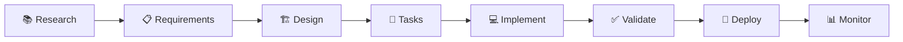

# 🚀 MUSUBI 5分間クイックスタート

**MUSUBI v3.5.1** | 最終更新: 2025-12-08

> 5分でMUSUBIを始めて、最初のSDD仕様書を作成しましょう！

---

## 📋 目次

1. [前提条件](#1-前提条件)
2. [インストール](#2-インストール)
3. [プロジェクト初期化](#3-プロジェクト初期化)
4. [最初の要件定義](#4-最初の要件定義)
5. [次のステップ](#5-次のステップ)

---

## 1. 前提条件

| 項目 | 要件 |
|------|------|
| **Node.js** | v18.0.0 以上 |
| **AIコーディングエージェント** | 以下のいずれか |

### 対応AIエージェント

| エージェント | 対応 | 初期化コマンド |
|-------------|------|----------------|
| Claude Code | ✅ Skills API | `musubi init --claude-code` |
| GitHub Copilot | ✅ AGENTS.md | `musubi init --copilot` |
| Cursor | ✅ AGENTS.md | `musubi init --cursor` |
| Gemini CLI | ✅ GEMINI.md | `musubi init --gemini` |
| Codex CLI | ✅ AGENTS.md | `musubi init --codex` |
| Qwen Code | ✅ QWEN.md | `musubi init --qwen` |
| Windsurf | ✅ AGENTS.md | `musubi init --windsurf` |

---

## 2. インストール

### 方法A: npx（推奨・インストール不要）

```bash
npx musubi-sdd init
```

### 方法B: グローバルインストール

```bash
npm install -g musubi-sdd
musubi init
```

### 方法C: プロジェクトローカル

```bash
npm install --save-dev musubi-sdd
npx musubi init
```

---

## 3. プロジェクト初期化

### 3.1 新規プロジェクト（Greenfield）

```bash
# 新しいプロジェクトディレクトリを作成
mkdir my-project && cd my-project

# MUSUBI初期化（GitHub Copilotの場合）
npx musubi-sdd init --copilot
```

**生成されるファイル構成:**

```
my-project/
├── AGENTS.md              # AIエージェント設定
├── steering/
│   ├── structure.md       # アーキテクチャパターン
│   ├── tech.md            # 技術スタック
│   ├── product.md         # プロダクトコンテキスト
│   ├── project.yml        # プロジェクト設定
│   └── rules/
│       ├── constitution.md # 9条の憲法
│       └── workflow.md     # SDDワークフロー
└── storage/
    ├── features/          # 機能仕様書
    ├── specs/             # 詳細仕様
    └── changes/           # 変更履歴
```

### 3.2 既存プロジェクト（Brownfield）

```bash
cd existing-project

# 自動解析してsteering docs生成
npx musubi-sdd onboard
```

**自動検出される項目:**
- 📦 使用技術（package.json, requirements.txt等）
- 📁 ディレクトリ構造
- 🔧 ビルドツール・フレームワーク

---

## 4. 最初の要件定義

### 4.1 AIエージェントでコマンド実行

| プラットフォーム | コマンド形式 |
|-----------------|-------------|
| Claude Code | `/sdd-requirements ログイン機能` |
| GitHub Copilot | `#sdd-requirements ログイン機能` |
| Cursor | `@sdd-requirements ログイン機能` |

### 4.2 CLIで要件生成

```bash
npx musubi-sdd requirements --feature login --output storage/specs/
```

### 4.3 生成される要件書（EARS形式）

```markdown
# Feature: Login Function
## Version: 1.0.0

### REQ-LOGIN-001: Basic Login
**Type**: Ubiquitous
**Pattern**: The system shall [action]
**Statement**: The system shall authenticate users with email and password.

### REQ-LOGIN-002: Session Management
**Type**: Event-Driven  
**Pattern**: When [trigger], the system shall [action]
**Statement**: When a user successfully logs in, the system shall create a session token valid for 24 hours.

### REQ-LOGIN-003: Failed Attempts
**Type**: State-Driven
**Pattern**: While [state], the system shall [action]
**Statement**: While login attempts exceed 5 failures, the system shall lock the account for 15 minutes.
```

---

## 5. 次のステップ

### 📚 SDDワークフロー8ステージ



### 🎯 よく使うコマンド

| ステージ | CLI | AIコマンド |
|---------|-----|-----------|
| 要件定義 | `musubi requirements` | `/sdd-requirements` |
| 設計 | `musubi design` | `/sdd-design` |
| タスク分解 | `musubi tasks` | `/sdd-tasks` |
| 実装 | `musubi workflow` | `/sdd-implement` |
| 検証 | `musubi validate` | `/sdd-validate` |

### 📖 追加リソース

- [CLI完全リファレンス](./cli-reference.md)
- [実践チュートリアル: ToDoアプリ開発](./tutorial-todo-app.md)
- [プラットフォーム別セットアップ](./platform-setup.md)
- [トラブルシューティング](./troubleshooting.md)
- [EARS要件フォーマット詳細](./ears-format.md)

---

## 💡 Tips

### Tip 1: プロジェクトメモリの更新

コードベースが変更されたら、steering docsを更新：

```bash
npx musubi-sdd remember --auto
```

### Tip 2: ギャップ分析

要件と実装の差異を確認：

```bash
npx musubi-sdd gaps
```

### Tip 3: 変更影響分析

変更の影響範囲を可視化：

```bash
npx musubi-sdd analyze --changes
```

---

**🎉 おめでとうございます！MUSUBIでのSDD開発を始める準備ができました！**

---

*ドキュメント生成: MUSUBI v3.5.1*
