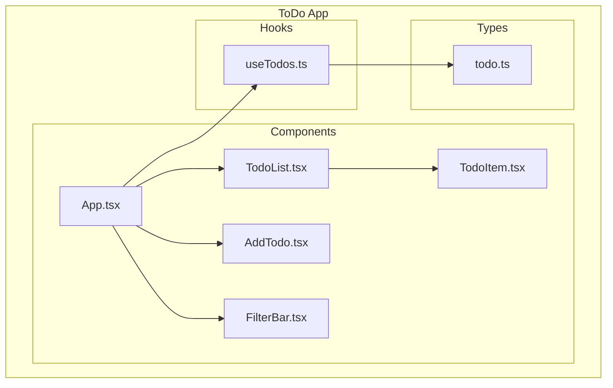

# 📱 実践チュートリアル: ToDoアプリ開発

**MUSUBI v3.5.1** | 最終更新: 2025-12-08

> MUSUBIのSDDワークフローを使って、ToDoアプリを要件定義から実装まで開発する実践ガイド

---

## 📋 目次

1. [概要](#1-概要)
2. [Stage 0: Research（調査）](#2-stage-0-research調査)
3. [Stage 1: Requirements（要件定義）](#3-stage-1-requirements要件定義)
4. [Stage 2: Design（設計）](#4-stage-2-design設計)
5. [Stage 3: Tasks（タスク分解）](#5-stage-3-tasksタスク分解)
6. [Stage 4: Implement（実装）](#6-stage-4-implement実装)
7. [Stage 5: Validate（検証）](#7-stage-5-validate検証)
8. [まとめ](#8-まとめ)

---

## 1. 概要

### 🎯 このチュートリアルで学ぶこと

- SDDワークフローの実践的な使い方
- EARS形式での要件定義
- C4モデルでの設計
- トレーサビリティの維持
- 憲法（Constitution）に準拠した開発

### 🛠️ 作成するアプリ

**ToDoアプリ**（シンプルなタスク管理アプリ）

| 機能 | 説明 |
|------|------|
| タスク追加 | 新しいToDoを追加 |
| タスク一覧 | ToDoリストを表示 |
| タスク完了 | ToDoを完了マーク |
| タスク削除 | ToDoを削除 |
| フィルター | 完了/未完了でフィルタリング |

### 📁 最終的なプロジェクト構造

```
todo-app/
├── AGENTS.md
├── steering/
│   ├── structure.md
│   ├── tech.md
│   ├── product.md
│   ├── project.yml
│   └── rules/
│       ├── constitution.md
│       └── workflow.md
├── storage/
│   ├── features/
│   │   └── todo-management.md
│   ├── specs/
│   │   └── design-todo.md
│   └── changes/
├── src/
│   ├── components/
│   │   ├── TodoList.tsx
│   │   ├── TodoItem.tsx
│   │   └── AddTodo.tsx
│   ├── hooks/
│   │   └── useTodos.ts
│   └── types/
│       └── todo.ts
└── tests/
    └── todo.test.ts
```

---

## 2. Stage 0: Research（調査）

### 2.1 プロジェクト初期化

```bash
# ディレクトリ作成
mkdir todo-app && cd todo-app

# MUSUBI初期化（GitHub Copilotの場合）
npx musubi-sdd init --copilot
```

### 2.2 技術スタック決定

`steering/tech.md` を編集:

```markdown
# Tech Stack

## Frontend
- **Framework**: React 18
- **Language**: TypeScript 5
- **Styling**: Tailwind CSS

## State Management
- **Local State**: React useState

## Build Tools
- **Bundler**: Vite
- **Package Manager**: npm

## Testing
- **Framework**: Vitest
- **Testing Library**: React Testing Library
```

### 2.3 プロダクトコンテキスト

`steering/product.md` を編集:

```markdown
# Product Context

## Vision
シンプルで使いやすいタスク管理アプリケーション

## Target Users
- 個人でタスクを管理したい人
- シンプルなインターフェースを好む人

## Key Features
1. タスクの追加・削除
2. 完了/未完了の切り替え
3. フィルタリング機能

## Success Metrics
- タスク追加が3クリック以内で完了
- ページ読み込み時間 < 1秒
```

---

## 3. Stage 1: Requirements（要件定義）

### 3.1 AIエージェントで要件生成

**GitHub Copilot の場合:**
```
#sdd-requirements ToDoアプリのタスク管理機能
```

**Claude Code の場合:**
```
/sdd-requirements ToDoアプリのタスク管理機能
```

### 3.2 CLIで要件生成

```bash
npx musubi-sdd requirements --feature todo-management --output storage/features/
```

### 3.3 生成される要件書

`storage/features/todo-management.md`:

```markdown
# Feature: ToDo Management
**Version**: 1.0.0
**Status**: Draft
**Created**: 2025-12-08

---

## Overview

ToDoアプリケーションのタスク管理機能。ユーザーがタスクを追加、表示、完了、削除できる。

---

## Requirements

### REQ-TODO-001: Add Task
**Type**: Event-Driven
**Priority**: Must Have
**Pattern**: When [trigger], the system shall [action]

**Statement**: 
When a user submits a new task with title, the system shall add the task to the list with status "incomplete".

**Acceptance Criteria**:
- [ ] AC-001: 空のタイトルは拒否される
- [ ] AC-002: 追加後、入力フィールドがクリアされる
- [ ] AC-003: 新しいタスクがリストの末尾に表示される

---

### REQ-TODO-002: Display Tasks
**Type**: Ubiquitous
**Priority**: Must Have
**Pattern**: The system shall [action]

**Statement**:
The system shall display all tasks with their title and completion status.

**Acceptance Criteria**:
- [ ] AC-001: タスクがリスト形式で表示される
- [ ] AC-002: 各タスクに完了チェックボックスが表示される
- [ ] AC-003: タスクがない場合は空状態メッセージを表示

---

### REQ-TODO-003: Complete Task
**Type**: Event-Driven
**Priority**: Must Have
**Pattern**: When [trigger], the system shall [action]

**Statement**:
When a user clicks the checkbox of a task, the system shall toggle the completion status.

**Acceptance Criteria**:
- [ ] AC-001: 未完了→完了に変更できる
- [ ] AC-002: 完了→未完了に変更できる
- [ ] AC-003: 完了タスクに取り消し線が表示される

---

### REQ-TODO-004: Delete Task
**Type**: Event-Driven
**Priority**: Must Have
**Pattern**: When [trigger], the system shall [action]

**Statement**:
When a user clicks the delete button of a task, the system shall remove the task from the list.

**Acceptance Criteria**:
- [ ] AC-001: 削除後、タスクがリストから消える
- [ ] AC-002: 削除は元に戻せない（確認ダイアログなし）

---

### REQ-TODO-005: Filter Tasks
**Type**: State-Driven
**Priority**: Should Have
**Pattern**: While [state], the system shall [action]

**Statement**:
While a filter is active, the system shall display only tasks matching the filter condition (All/Active/Completed).

**Acceptance Criteria**:
- [ ] AC-001: "All" で全タスク表示
- [ ] AC-002: "Active" で未完了のみ表示
- [ ] AC-003: "Completed" で完了のみ表示

---

## Traceability

| Requirement | Design | Implementation | Test |
|-------------|--------|----------------|------|
| REQ-TODO-001 | DES-TODO-001 | AddTodo.tsx | todo.test.ts |
| REQ-TODO-002 | DES-TODO-002 | TodoList.tsx | todo.test.ts |
| REQ-TODO-003 | DES-TODO-003 | TodoItem.tsx | todo.test.ts |
| REQ-TODO-004 | DES-TODO-004 | TodoItem.tsx | todo.test.ts |
| REQ-TODO-005 | DES-TODO-005 | TodoList.tsx | todo.test.ts |
```

---

## 4. Stage 2: Design（設計）

### 4.1 設計生成

```bash
npx musubi-sdd design --feature todo-management --output storage/specs/
```

### 4.2 C4 Component Diagram



### 4.3 データモデル

```typescript
// src/types/todo.ts
interface Todo {
  id: string;
  title: string;
  completed: boolean;
  createdAt: Date;
}

type FilterType = 'all' | 'active' | 'completed';
```

### 4.4 ADR（アーキテクチャ決定記録）

`storage/specs/adr-001-state-management.md`:

```markdown
# ADR-001: State Management

## Status
Accepted

## Context
ToDoアプリの状態管理方法を決定する必要がある。

## Decision
React useState を使用したローカル状態管理を採用する。

## Rationale
- アプリが小規模でシンプル
- 外部ライブラリ（Redux等）はオーバーエンジニアリング
- 将来的な拡張時にContext APIへ移行可能

## Consequences
- ✅ 学習コストが低い
- ✅ バンドルサイズが小さい
- ⚠️ 複雑な状態管理には不向き
```

---

## 5. Stage 3: Tasks（タスク分解）

### 5.1 タスク生成

```bash
npx musubi-sdd tasks --feature todo-management
```

### 5.2 タスク一覧

```markdown
# Tasks: ToDo Management

## TASK-001: Setup Project Structure
**Estimate**: 30min
**Dependencies**: None
**Requirements**: All

1. Vite + React + TypeScript プロジェクト作成
2. Tailwind CSS 設定
3. ディレクトリ構造作成

---

## TASK-002: Implement Todo Type (RED→GREEN)
**Estimate**: 15min
**Dependencies**: TASK-001
**Requirements**: REQ-TODO-001, REQ-TODO-002

1. ❌ テスト作成: todo.test.ts (RED)
2. ✅ 型定義: src/types/todo.ts (GREEN)

---

## TASK-003: Implement useTodos Hook (RED→GREEN)
**Estimate**: 45min
**Dependencies**: TASK-002
**Requirements**: REQ-TODO-001, REQ-TODO-003, REQ-TODO-004

1. ❌ テスト作成: useTodos.test.ts (RED)
2. ✅ Hook実装: src/hooks/useTodos.ts (GREEN)
   - addTodo()
   - toggleTodo()
   - deleteTodo()

---

## TASK-004: Implement AddTodo Component
**Estimate**: 30min
**Dependencies**: TASK-003
**Requirements**: REQ-TODO-001

1. ❌ テスト作成 (RED)
2. ✅ コンポーネント実装 (GREEN)

---

## TASK-005: Implement TodoItem Component
**Estimate**: 30min
**Dependencies**: TASK-003
**Requirements**: REQ-TODO-002, REQ-TODO-003, REQ-TODO-004

1. ❌ テスト作成 (RED)
2. ✅ コンポーネント実装 (GREEN)

---

## TASK-006: Implement TodoList Component
**Estimate**: 30min
**Dependencies**: TASK-004, TASK-005
**Requirements**: REQ-TODO-002, REQ-TODO-005

1. ❌ テスト作成 (RED)
2. ✅ コンポーネント実装 (GREEN)

---

## TASK-007: Implement Filter Feature
**Estimate**: 30min
**Dependencies**: TASK-006
**Requirements**: REQ-TODO-005

1. ❌ テスト作成 (RED)
2. ✅ フィルター実装 (GREEN)

---

## Summary

| Task | Estimate | Status |
|------|----------|--------|
| TASK-001 | 30min | ⬜ |
| TASK-002 | 15min | ⬜ |
| TASK-003 | 45min | ⬜ |
| TASK-004 | 30min | ⬜ |
| TASK-005 | 30min | ⬜ |
| TASK-006 | 30min | ⬜ |
| TASK-007 | 30min | ⬜ |
| **Total** | **3.5h** | |
```

---

## 6. Stage 4: Implement（実装）

### 6.1 プロジェクトセットアップ（TASK-001）

```bash
npm create vite@latest . -- --template react-ts
npm install
npm install -D tailwindcss postcss autoprefixer
npx tailwindcss init -p
```

### 6.2 型定義（TASK-002）

```typescript
// src/types/todo.ts
export interface Todo {
  id: string;
  title: string;
  completed: boolean;
  createdAt: Date;
}

export type FilterType = 'all' | 'active' | 'completed';
```

### 6.3 useTodos Hook（TASK-003）

```typescript
// src/hooks/useTodos.ts
import { useState, useCallback } from 'react';
import { Todo, FilterType } from '../types/todo';

export function useTodos() {
  const [todos, setTodos] = useState<Todo[]>([]);
  const [filter, setFilter] = useState<FilterType>('all');

  // REQ-TODO-001: Add Task
  const addTodo = useCallback((title: string) => {
    if (!title.trim()) return;
    
    const newTodo: Todo = {
      id: crypto.randomUUID(),
      title: title.trim(),
      completed: false,
      createdAt: new Date(),
    };
    
    setTodos(prev => [...prev, newTodo]);
  }, []);

  // REQ-TODO-003: Complete Task
  const toggleTodo = useCallback((id: string) => {
    setTodos(prev =>
      prev.map(todo =>
        todo.id === id ? { ...todo, completed: !todo.completed } : todo
      )
    );
  }, []);

  // REQ-TODO-004: Delete Task
  const deleteTodo = useCallback((id: string) => {
    setTodos(prev => prev.filter(todo => todo.id !== id));
  }, []);

  // REQ-TODO-005: Filter Tasks
  const filteredTodos = todos.filter(todo => {
    if (filter === 'active') return !todo.completed;
    if (filter === 'completed') return todo.completed;
    return true;
  });

  return {
    todos: filteredTodos,
    allTodos: todos,
    filter,
    setFilter,
    addTodo,
    toggleTodo,
    deleteTodo,
  };
}
```

### 6.4 コンポーネント実装

```typescript
// src/components/AddTodo.tsx
import { useState, FormEvent } from 'react';

interface AddTodoProps {
  onAdd: (title: string) => void;
}

export function AddTodo({ onAdd }: AddTodoProps) {
  const [title, setTitle] = useState('');

  const handleSubmit = (e: FormEvent) => {
    e.preventDefault();
    onAdd(title);
    setTitle(''); // AC-002: 入力フィールドをクリア
  };

  return (
    <form onSubmit={handleSubmit} className="flex gap-2 mb-4">
      <input
        type="text"
        value={title}
        onChange={(e) => setTitle(e.target.value)}
        placeholder="Add a new task..."
        className="flex-1 px-4 py-2 border rounded"
      />
      <button
        type="submit"
        className="px-4 py-2 bg-blue-500 text-white rounded hover:bg-blue-600"
      >
        Add
      </button>
    </form>
  );
}
```

```typescript
// src/components/TodoItem.tsx
import { Todo } from '../types/todo';

interface TodoItemProps {
  todo: Todo;
  onToggle: (id: string) => void;
  onDelete: (id: string) => void;
}

export function TodoItem({ todo, onToggle, onDelete }: TodoItemProps) {
  return (
    <li className="flex items-center gap-2 p-2 border-b">
      <input
        type="checkbox"
        checked={todo.completed}
        onChange={() => onToggle(todo.id)}
        className="w-5 h-5"
      />
      <span className={`flex-1 ${todo.completed ? 'line-through text-gray-400' : ''}`}>
        {todo.title}
      </span>
      <button
        onClick={() => onDelete(todo.id)}
        className="px-2 py-1 text-red-500 hover:bg-red-100 rounded"
      >
        Delete
      </button>
    </li>
  );
}
```

```typescript
// src/components/TodoList.tsx
import { Todo } from '../types/todo';
import { TodoItem } from './TodoItem';

interface TodoListProps {
  todos: Todo[];
  onToggle: (id: string) => void;
  onDelete: (id: string) => void;
}

export function TodoList({ todos, onToggle, onDelete }: TodoListProps) {
  if (todos.length === 0) {
    return (
      <p className="text-center text-gray-500 py-4">
        No tasks yet. Add one above!
      </p>
    );
  }

  return (
    <ul className="border rounded">
      {todos.map(todo => (
        <TodoItem
          key={todo.id}
          todo={todo}
          onToggle={onToggle}
          onDelete={onDelete}
        />
      ))}
    </ul>
  );
}
```

---

## 7. Stage 5: Validate（検証）

### 7.1 テスト実行

```bash
npm test
```

### 7.2 トレーサビリティ検証

```bash
npx musubi-sdd trace --feature todo-management
```

### 7.3 要件カバレッジ確認

```bash
npx musubi-sdd validate --feature todo-management
```

**出力例:**
```
✅ REQ-TODO-001: Add Task - Covered (AddTodo.tsx, useTodos.ts)
✅ REQ-TODO-002: Display Tasks - Covered (TodoList.tsx)
✅ REQ-TODO-003: Complete Task - Covered (TodoItem.tsx, useTodos.ts)
✅ REQ-TODO-004: Delete Task - Covered (TodoItem.tsx, useTodos.ts)
✅ REQ-TODO-005: Filter Tasks - Covered (useTodos.ts)

Coverage: 5/5 (100%)
```

---

## 8. まとめ

### 📊 完了したSDDワークフロー

| Stage | 成果物 | 状態 |
|-------|--------|------|
| 0. Research | tech.md, product.md | ✅ |
| 1. Requirements | todo-management.md (5 REQs) | ✅ |
| 2. Design | C4 Diagram, ADR-001 | ✅ |
| 3. Tasks | 7 Tasks (3.5h) | ✅ |
| 4. Implement | 5 Components, 1 Hook, 1 Type | ✅ |
| 5. Validate | 100% Coverage | ✅ |

### 🔗 トレーサビリティマトリクス

```
REQ-TODO-001 ─→ DES-TODO-001 ─→ AddTodo.tsx ─→ addTodo.test.ts
REQ-TODO-002 ─→ DES-TODO-002 ─→ TodoList.tsx ─→ todoList.test.ts
REQ-TODO-003 ─→ DES-TODO-003 ─→ TodoItem.tsx ─→ toggle.test.ts
REQ-TODO-004 ─→ DES-TODO-004 ─→ TodoItem.tsx ─→ delete.test.ts
REQ-TODO-005 ─→ DES-TODO-005 ─→ useTodos.ts ─→ filter.test.ts
```

### 💡 学んだこと

1. **EARS形式** - 曖昧さのない要件定義
2. **Red-Green-Refactor** - テストファーストな実装
3. **トレーサビリティ** - 要件→設計→コード→テストの追跡
4. **憲法準拠** - 品質基準の一貫性

### 📚 次のステップ

- [永続化機能の追加（LocalStorage）](./tutorial-todo-advanced.md)
- [認証機能の追加](./tutorial-auth.md)
- [デプロイ（Vercel）](./tutorial-deploy.md)

---

*ドキュメント生成: MUSUBI v3.5.1*
